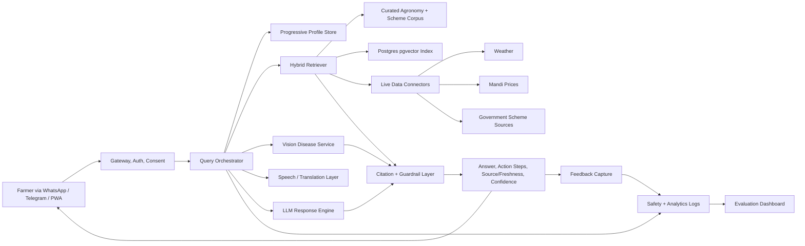

# KisanAI Pitch Page Source Analysis

## Source Scope

Read completely:

- `public/KisanAI Deep Research Report and Investor Q&A Dossier.md`
- `public/kishanai-reseach-2.md`
- `public/kishanai-reseach.md`

This spec extracts pitch material from those three source files only. Where the source files cite URLs, those URLs are carried forward. Where they make assumptions or scenario models, this file labels them as assumptions. Do not present assumptions as traction.

## Extraction Caveats

- Public KisanAI traction is not proven in the supplied files. Do not claim revenue, DAU, MAU, retention, paid pilots, partnerships, government tie-ups, or farmer outcomes unless new evidence is added.
- Founder/team clarity is incomplete. `kishanai-reseach-2.md` connects Product Hunt and portfolio evidence to Shaswat Raj, but the deeper dossier says founder credentials, entity status, and team depth remain unspecified publicly.
- Site crawl evidence is limited. The source reports repeatedly say the live site is JavaScript-heavy and that rendered body text was not always extractable.
- Several source citations use crawler-local markers such as `turn50search1`; preserve the underlying fact only when the source file gives a usable source name or URL. Treat crawler-local markers without URLs as lower-quality until replaced with direct citations.
- Market sizing models are assumption-led. They are useful for planning and pitch framing but should not be described as audited TAM.
- Some infrastructure pricing/model names in source files may age quickly. Re-verify before publishing pricing claims.

## Core Positioning

### One-Line Pitch

KisanAI is a vernacular, mobile-first AI assistant that helps Indian farmers make better daily crop decisions through disease triage, weather-to-action advice, mandi-price context, and plain-language government-scheme guidance.

### Short Tagline Options

- Ask in your language. Send a crop photo. Get the next farming step.
- One trusted assistant for daily farm decisions.
- Vernacular crop, weather, price, and scheme help for Indian farmers.
- A safer, simpler AI layer for last-mile agricultural advisory.

### 30-Second Pitch

Indian farmers still make high-stakes decisions using fragmented advice from dealers, neighbours, government portals, WhatsApp groups, weather apps, and mandi agents. When information is late, confusing, or not available in a local language, the cost can be crop loss, repeated trips, poor selling decisions, or missed schemes. KisanAI brings disease triage, weather interpretation, mandi-price context, and scheme guidance into one mobile-first assistant that works in farmers' own languages. The wedge is narrow and practical: start with one crop cluster, one region, and one partner-led distribution channel, then prove repeat use and trust before scaling.

### 2-Minute Pitch

Agriculture decisions in India are urgent, local, and economically unforgiving. A farmer facing a new leaf symptom, unexpected rain, a mandi visit, or a scheme deadline needs a clear answer now, not a PDF, a broken app flow, or a generic weather forecast. The supplied research shows this pain clearly: public reporting cited in the dossiers describes farmers confused by registration documents, blocked by blank app sections, unable to enter land details, forced into repeated office trips, and pushed into distress after weather and disease shocks.

KisanAI addresses this as a vernacular decision assistant for Indian farmers. The product direction, based on public KisanAI descriptions in the research, includes regional-language Q&A, crop-disease detection from images, hyper-local weather, mandi prices, and simplified government-scheme explanations. The recommended pitch-page narrative should not frame KisanAI as "all agriculture for all India." It should frame KisanAI as a trust-first assistant for recurring daily decisions, initially narrowed by crop, region, language, and partner channel.

The timing is strong. The source files cite government movement into multilingual AI advisory through Bharat-VISTAAR, private adoption signals such as Bayer FarmRise crossing 5 million users, Cropin outcome stories, PM-KISAN beneficiary scale around 9.7 crore farmers, and wider smartphone/internet adoption signals. These validate the category: farmers and institutions already use digital agricultural tools when they are relevant and practical.

The business model should begin B2B2C rather than pure direct subscription. FPOs, NGOs, agri-input retailers, KVK-linked channels, and agribusiness partners can concentrate usage, lower CAC, and create credible pilot evidence. Longer-term options include freemium farmer plans, enterprise/API advisory, white-label partner deployments, expert escalation, and carefully governed commerce/referrals. The immediate investable proof to build is not a bigger feature list; it is a live pilot cohort with activation, day-7/day-30 retention, grounded-answer quality, safety escalation, and partner willingness to pay.

## Problem

### Core Problem Statement

Indian farmers face recurring, high-stakes decisions, but the information they need is scattered across human networks, portals, apps, market intermediaries, and government documents. Existing digital tools can be too complex, not local-language-first, unreliable, or poorly connected to the actual decision a farmer must make today.

### Evidence Themes From Sources

| Problem Theme | Extracted Evidence | Pitch Use |
|---|---|---|
| Digital workflow complexity | Farmers reportedly could not understand which document was needed for Kisan Kapas registration. | Show that "digitization" alone does not solve farmer access. |
| Broken app trust | APMC section reported blank in a procurement app. | Make reliability and simplicity central to KisanAI's differentiation. |
| Data-entry friction | A farmer quote says land details could not be added and called it the "Worst experience ever." | Support progressive profiling and no-mandatory-profile onboarding. |
| Operational cost of failed systems | Andhra cotton farmers reportedly made repeated trips to village secretariats due to app/procurement failures. | Show that bad digital UX creates real offline cost. |
| Crop-loss distress | Onion growers reported debt and possible land sale after heavy rains/disease. | Establish economic urgency for disease/weather triage. |
| Local-language gap | Founder/research notes say existing tools are too complex or not available in local languages. | Support vernacular-first assistant positioning. |

## Why Now

### Timing Narrative

KisanAI sits at the intersection of three timing shifts:

1. Farmer-facing digital adoption is already real, shown by large user/download numbers for FarmRise, Plantix, BharatAgri, Krishify, and DeHaat cited in the source reports.
2. Public and institutional interest in AI agricultural advisory is rising, with Bharat-VISTAAR cited as a multilingual AI advisory initiative.
3. Multilingual, retrieval-backed AI and mobile messaging channels make it more feasible to deliver local-language, low-friction decision support than earlier forum/call-centre models.

### Why-Now Proof Points

- Bharat-VISTAAR: agriculture ministry launch of a multilingual AI tool for digital farm advisories.
- Bayer FarmRise: crossed 5 million users in India.
- PM-KISAN: reporting cited around 9.7 crore beneficiary farmers for the twentieth instalment.
- Digital access: one source cites 85.5% of households with at least one smartphone and 86.3% with internet access within household premises; another cites 950 million Indian internet users in 2025.
- Competitor scale: Plantix 10M+ downloads, BharatAgri 5M+ downloads, Krishify 1 crore+ farmers, DeHaat 1.4M+ farmers in 12 states.

## Market Size

### Conservative Planning Model

Use this only as an assumption-led market model:

| Layer | Assumption | Calculation | Annual Value Assumption | Output |
|---|---:|---:|---:|---:|
| TAM | 9.7 crore PM-KISAN-linked farmers | 97,000,000 farmers | Rs 600/farmer/year | Rs 58.2 billion |
| SAM | 45% reachable for smartphone-assisted vernacular advisory | 43,650,000 farmers | Rs 600/farmer/year | Rs 26.19 billion |
| SOM | 0.5% of SAM captured by year 3 | 218,250 farmers | Rs 600/farmer/year | Rs 130.95 million |

Pitch-page guidance:

- Label this as a conservative planning model, not audited TAM.
- Anchor the market in identifiable farmer beneficiary/digital-access proxies, not generic "India agriculture GDP."
- Use macro agriculture GVA only as backdrop, not as the software TAM.

### Additional Market Anchors

- Official/planning sources in `kishanai-reseach-2.md` cite 12.5 crore small and marginal farmer landholders as a planning base for a major farmer scheme.
- Agriculture and allied GVA is cited as Rs 52,08,800 crore in second advance estimates for 2025-26.
- 89.4% of agricultural households are cited as owning less than two hectares.

## Adoption And Ecosystem Data

### Farmer Digital Adoption

| Signal | Use |
|---|---|
| FarmRise crossed 5 million users | Proves farmer-facing digital adoption can scale in India. |
| Plantix 10M+ downloads | Proves crop-diagnosis/advisory demand at app scale. |
| BharatAgri 5M+ downloads | Proves crop advice plus agri-commerce apps can reach large audiences. |
| Krishify 1 crore+ farmers | Proves farmer community/info products can reach broad networks. |
| DeHaat 1.4M+ farmers in 12 states | Proves full-stack agri services can aggregate farmers. |

### Rural Digital Infrastructure

Use carefully because some source citations are crawler-local rather than direct URLs:

- India internet users crossed 950 million in 2025, per IAMAI/NDTV reporting cited in `kishanai-reseach-2.md`.
- 85.5% of households with at least one smartphone and 86.3% with internet access within household premises, cited in `kishanai-reseach-2.md`.
- Rural India internet subscribers around 375.66 million and rural penetration around 41.72% as of late 2023, cited in `kishanai-reseach.md`.
- 5G coverage over 99% of districts by early 2025, cited in `kishanai-reseach.md`.

### Smartphone / Broadband / UPI / DPI

The supplied files have useful smartphone and internet/DPI-adjacent proof, but do not include strong direct UPI agriculture usage evidence. For the pitch page:

- Use PM-KISAN as the strongest DPI-style farmer-beneficiary rail.
- Use smartphone/internet adoption as digital-access proof.
- Do not claim UPI-driven farmer monetisation unless a direct source is added.
- Do not claim Aadhaar/ONDC/eNAM integration unless implemented or explicitly sourced.

### Government Schemes / Farmer Ecosystem

- PM-KISAN beneficiary scale: about 9.7 crore farmers in cited reporting.
- PM-Kisan Samman Nidhi appears as a visible workflow in KisanAI app-home audit from `kishanai-reseach-2.md`.
- Bharat-VISTAAR validates government interest in multilingual AI advisory.
- eNAM is an established government-backed market/price discovery infrastructure, but it is not a conversational assistant.
- KVKs, FPOs, NGOs, cooperatives, agri-input retailers, and extension events are recommended GTM partners, but no KisanAI partnership with them is proven.

## Agriculture Workforce / Economy Data

Use as backdrop:

- India agriculture and allied GVA cited at Rs 52,08,800 crore in 2025-26 second advance estimates.
- 12.5 crore small and marginal farmer landholders cited as a major scheme planning base.
- 89.4% of agricultural households own less than two hectares.

Pitch use: "large economy, smallholder-heavy, digitally reachable, but underserved by practical advisory."

## Climate, Weather, And Crop-Loss Pain Points

### Pain Narrative

Climate and weather risk turns advisory from "nice-to-have" into a recurring decision-support need. Farmers need to know what to do after heavy rain, heat, disease signs, or price shocks, not merely what the forecast says.

### Evidence From Sources

- Onion crop losses after heavy rains and disease, with farmers citing debt and potential land sale.
- One onion grower cited around Rs 80,000 per acre spend before losses.
- Reuters/Guardian reporting in the source files mentions above-average temperatures threatening wheat and winter crops, late monsoon downpours damaging soybean/cotton, distress selling, and severe flooding.
- Crop and weather events should be framed as decision triggers: "What should I do today?" rather than generic climate commentary.

## Competitor Data

### Competitor Set

| Competitor / Substitute | Strength | Weakness / Opening For KisanAI |
|---|---|---|
| Plantix | Strong crop diagnosis brand; 10M+ downloads; 30 crops and 780+ damages cited in sources. | Disease-first and commerce-linked trust questions; KisanAI can be broader assistant layer with transparent sourcing. |
| Cropin | Enterprise agronomy/data intelligence; Reuters cites measurable outcome stories. | Enterprise-first, not a lightweight vernacular farmer assistant. |
| DeHaat | Full-stack services, market linkage, input/advisory scale; source cites FY25 revenue around Rs 3,000 crore and 1.4M+ farmers in 12 states. | Operationally broad; KisanAI can be simpler and assistant-first. |
| Bayer FarmRise | 5M users; large corporate distribution. | Corporate ecosystem may raise neutrality concerns; less nimble than a focused startup. |
| BharatAgri | 5M+ downloads; advice plus shopping. | Less clearly AI-assistant-first. |
| Krishify | 1 crore+ farmer community/info network. | KisanAI can focus on actionable decision support over community content. |
| KissanAI | Separate multilingual agri-AI startup with institutional visibility. | Different product/company; KisanAI must clarify brand differentiation. |
| Bharat-VISTAAR | Government legitimacy and distribution potential. | Broad mandate; UX/local iteration uncertain. KisanAI should position as pilot-friendly and interoperable, not anti-government. |
| eNAM | Market infrastructure and price discovery. | Not a conversational interpretation layer. |
| aAQUA | Longstanding multilingual farmer Q&A precedent. | Expert/forum model can be slower and less multimodal. |
| Dealers / WhatsApp / neighbours | Trusted, existing behaviour. | Fragmented, biased, inconsistent, not always source-backed. |

### Positioning Against Competition

KisanAI should not claim "we beat incumbents across every feature." The pitch should say:

> Incumbents prove demand. KisanAI wins by being narrower, faster to localise, easier to use, source-aware, and built around the farmer's next action in their own language.

## Agritech Funding And Startup Benchmarks

The source files give stronger category benchmark data than direct funding data.

### Benchmarks To Use

- DeHaat: large-scale full-stack benchmark; FY25 revenue around Rs 3,000 crore in source file.
- FarmRise: 5M-user benchmark for corporate farmer app adoption.
- Plantix: 10M+ download benchmark for disease/advisory app scale.
- Cropin: benchmark for enterprise advisory/analytics and outcome-based value.
- KissanAI: benchmark for agri-specific multilingual AI mindshare and institutional collaboration.

### Funding Signal Caveat

The supplied sources do not provide a robust recent agritech funding market analysis. Do not add claims like "agritech funding is surging" unless separately sourced. Safer phrasing:

> The category is validated by scaled incumbents and government-backed AI advisory activity; KisanAI's fundraising case depends on pilot proof, retention, and distribution, not broad market hype.

## Business Models

### Recommended Model Sequence

| Stage | Model | Pricing / Mechanic | Rationale |
|---|---|---|---|
| 1 | B2B2C pilots | Rs 15-30 per covered farmer/month or annual pilot contract | Lower CAC, concentrated usage, better evidence. |
| 2 | Freemium farmer plan | Free core; Rs 49/month or Rs 399-699/year premium | Only after trust and habit are proven. |
| 3 | Expert escalation | Paid agronomist review or support escalation | Farmers may pay for risk-reducing human validation. |
| 4 | Enterprise/API/white-label | Custom annual contracts | Better ACV for agribusinesses, NGOs, lenders, insurers, and government partners. |
| 5 | Commerce/referrals | Lead-gen/revenue share on verified products/services | Must preserve neutrality and disclose commercial bias. |

### Model-Specific Notes

- B2C: fragile early unless CAC is very low and retention is strong.
- B2B: higher ACV and reporting needs; requires admin dashboard and contract reliability.
- B2B2C: best near-term fit through FPOs, NGOs, input retailers, KVK-linked pilots.
- Government: promising after pilots; do not imply official partnership without proof.
- FPO/NGO: strong pilot channel; can validate farmer outcomes and field support needs.
- Agri-input: monetisable, but trust risk if advice appears biased toward product sales.
- Fintech/insurance: logical adjacency but should wait; avoid regulated advice claims without partners and compliance.

## AI Safety

### Safety Principles

- Do not provide definitive disease diagnosis unless validated. Use "possible issue" and confidence levels.
- Show source/freshness labels for schemes, mandi prices, and weather-related advice.
- Ask clarifying questions for crop, location, stage, and symptom context.
- Escalate uncertain, high-risk, chemical, severe disease, finance, insurance, or legal questions.
- Maintain a golden evaluation set by crop, language, task, and risk class.
- Track false-advice rate, grounded-answer rate, abstention rate, escalation rate, and complaint rate.

### Guardrail Architecture

The recommended architecture from the sources is:

- intent detection;
- context completion;
- hybrid retrieval from curated official/agronomy sources;
- dedicated vision disease service;
- LLM response engine;
- citation and guardrail layer;
- feedback and quality dashboard.

## Compliance, Privacy, And DPDP

KisanAI likely processes phone numbers, names/auth identifiers, language, crop details, locations, images, chats, orders/posts, and possibly land-linked context. That makes privacy and consent material to the product.

### Minimum Compliance Requirements

| Area | Requirement |
|---|---|
| Privacy policy | Visible, standalone, local-language-friendly. |
| Terms | Include agricultural advice disclaimer, marketplace terms, liability boundaries. |
| Consent | Separate consent for images, location, marketing, and partner sharing. |
| Data minimisation | Do not require land records or identity documents for basic advice. |
| Retention/deletion | Publish retention windows for chats, photos, profile data, and orders. |
| Security | Encryption in transit/at rest, RBAC, audit logs, vendor inventory. |
| Children | Avoid child-targeted profiling and behavioural targeting. |
| Grievance/support | Clear contact and complaint channel. |
| Model governance | Dataset/source register, prompt/model versions, evaluation history, rollback path. |

### Pitch Caveat

The source files repeatedly say privacy/terms/contact pages were not clearly discoverable in the reviewed crawl. Treat this as a priority gap before scaling.

## Roadmap

### 90-Day Roadmap

| Window | Focus | Outputs |
|---|---|---|
| Days 0-30 | Trust and focus | Publish Privacy/Terms/Contact/AI disclaimer; choose one crop, one language, one region; instrument activation and repeat-use analytics. |
| Days 30-60 | MVP quality | Build/strengthen disease triage, weather-to-action, mandi/scheme source layer, confidence labels, escalation, and partner onboarding kit. |
| Days 60-90 | Pilot proof | Run one FPO/NGO/dealer/KVK-linked pilot; measure day-7/day-30 retention, answer quality, safety incidents, partner willingness to pay. |

### Expansion Path

1. One crop cluster and one language.
2. Add adjacent crops in same geography.
3. Add more districts/mandi feeds/scheme coverage.
4. Add partner admin dashboards and B2B reporting.
5. Add expert escalation and carefully governed commerce/referrals.
6. Add enterprise/API/white-label surfaces.

## Technical Architecture

### Recommended Architecture

### Stack From Sources

- Public founder/research descriptions mention Next.js, Cloudflare Workers, PostgreSQL, and a multilingual model pipeline.
- `kishanai-reseach-2.md` also cites portfolio/GitHub evidence around Python, AI/ML, computer vision, Telegram Bot, React, Next.js, Flask/WhatsApp prototype, Gemini, speech, translation, knowledge base, and image analysis.
- Recommended MVP stack: Next.js PWA, messaging entry points, Cloudflare Workers or edge/API layer, Postgres with pgvector, Cloudflare R2 for objects, dedicated crop-disease service, hybrid retrieval, analytics/evaluation dashboard.

## Investor / Government / Partner Q&A

### High-Impact Investor Questions

| Question | Best Answer |
|---|---|
| Why this problem? | Farmers make urgent economic decisions with fragmented, confusing, or unreliable information. Public examples show registration confusion, broken app flows, repeated trips, and crop-loss distress. |
| Why now? | Farmer digital adoption is already proven by scaled apps; government is validating AI advisory through Bharat-VISTAAR; multilingual AI and messaging channels now make low-friction advisory feasible. |
| Who is the initial user? | Not all farmers. Start with one crop cluster, one geography, one dominant language, and partner-assisted onboarding. |
| Why will farmers trust KisanAI? | Trust must be built through local language, source/freshness labels, confidence levels, uncertainty handling, and escalation. We should not ask farmers to trust a black-box chatbot. |
| What is the wedge? | The "today's next action" loop: send a crop photo or ask a local question and get a safe, simple next step around disease, weather, price, or scheme. |
| Why not Bharat-VISTAAR/FarmRise/DeHaat? | They validate the market. KisanAI can be narrower, faster to localise, partner-friendly, and simpler at the daily decision layer. |
| How do you distribute cheaply? | Through FPOs, NGOs, agri-input retailers, KVK-linked events, WhatsApp/Telegram groups, and vernacular content, not app-store-only acquisition. |
| What is the business model? | B2B2C pilots first, freemium/direct later, enterprise/API once quality and partner reporting are proven. |
| How do you prevent hallucinations? | Retrieval-backed answers, source-restricted outputs, confidence labels, blocked high-risk categories, escalation, and a golden evaluation set. |
| What is the unfair advantage? | Publicly unspecified today. It must be built through partner distribution, localised knowledge quality, trust UX, and proprietary interaction/feedback data from pilots. |

### Government / Public-Sector Questions

| Question | Best Answer |
|---|---|
| Are you replacing extension officers? | No. KisanAI is a first-response and interpretation layer that can escalate uncertain or high-risk cases to local experts/KVKs. |
| How does this support government schemes? | It can translate scheme requirements into plain-language checklists, source-linked explanations, and eligibility guidance. It should not guarantee benefits. |
| How will you handle local languages? | Start with one regional language plus Hindi/English fallback, measure language adequacy, and expand only after quality is reliable. |
| Can this integrate with government systems? | Potentially, but the first step is source-linked advisory and pilot evidence. No integration should be implied until approved. |
| How do you protect farmer data? | DPDP-aligned consent, minimisation, retention/deletion policy, encryption, RBAC, audit logs, and clear grievance process. |

### Partner Questions

| Question | Best Answer |
|---|---|
| What do FPOs/NGOs get? | Faster query handling, standardised advisory, engagement data, and a way to support more farmers without every question becoming manual. |
| What do agri-input partners get? | Higher-intent leads and farmer support, but recommendations must remain transparent and not falsely neutral if commercially influenced. |
| What does a pilot require? | One crop, one district or cluster, one language, onboarding support, weekly safety/retention review, and agreed success metrics. |
| What metrics prove value? | Activation, repeat queries, disease scan completion, grounded-answer rate, escalation rate, CSAT, and partner support-load reduction. |

## Trick Questions, Diligence Questions, And Best Answers

| Question | Best Answer | Proof / Caveat |
|---|---|---|
| Is this just a chatbot wrapper? | No. The durable value is in crop/location context, curated retrieval, live data connectors, safety UX, partner distribution, and feedback loops. | Requires implementation proof; do not overclaim current maturity. |
| Can you serve every crop and Indian language now? | No. The responsible path is narrow coverage first, then expansion where quality and retention prove out. | Supported by source recommendations to narrow wedge. |
| Can school-going children operate it for every farmer? | We do not have evidence for that claim. We design for family-assisted use and validate household usage in pilots. | Explicitly called unsupported in source. |
| Will farmers pay? | Direct KisanAI willingness to pay is unproven. Adjacent markets show monetisable value; start with partner-paid pilots and test farmer premium later. | Do not claim paid demand without data. |
| Do you have government partnerships? | Not proven in supplied sources. We can be compatible with government schemes and public advisories, but should not imply endorsement. | Avoid fabrication. |
| What traction do you have? | Public traction is not established in supplied files. The next milestone is pilot activation, retention, safety, and partner willingness to pay. | Be honest. |
| What is the moat? | It is not public yet. Build it through localised data, workflow trust, partner distribution, and proprietary feedback from repeated use. | Do not claim proprietary dataset unless documented. |
| What if AI gives unsafe chemical advice? | Restrict high-risk recommendations, show uncertainty, require sources, escalate to experts, and log/review safety events. | Safety architecture required before scale. |
| Are you legally ready for farmer data? | Not yet, if standalone privacy/terms/consent pages remain undiscoverable. Publish DPDP-aligned policies before growth. | Source files flag this as gap. |
| Are you a marketplace, fintech, insurance, or advisory company? | Start as advisory/decision-support. Commerce, fintech, and insurance are later adjacencies once trust, compliance, and partners exist. | Prevents scope creep. |

## Pitch Page Content Requirements

### Must Include

- One-line pitch.
- 30-second pitch paragraph.
- Problem section with specific pain evidence.
- Why-now section with digital adoption, government AI, and competitor-scale proof.
- Product wedge: disease, weather, prices, schemes, in local language.
- Proof map table or linked claim source file.
- Responsible AI/safety section.
- B2B2C-first GTM and roadmap.
- Clear "what is proven vs what remains to prove" block.

### Must Not Include Without New Evidence

- Claimed farmer count for KisanAI.
- Claimed revenue.
- Claimed government partnership.
- Claimed FPO/NGO/dealer partnerships.
- Claimed accuracy/yield improvement.
- Claimed DPDP compliance completion.
- Claimed UPI/DPI integration.
- Claimed pan-India crop/language coverage.

