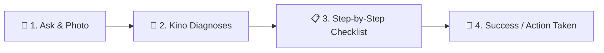

# KisanAI Premium Design System
> Playful, Encouraging, and Ultra-Readable: A Duolingo-Inspired UX for Every Indian Farmer.

---

## 🎨 Brand & Design Philosophy
Indian farmers make high-stakes, stressful decisions daily. Our interface shouldn't feel like a cold corporate database or a complex government portal. Drawing direct inspiration from **Duolingo**, KisanAI is designed to feel **playful, highly visual, reassuring, and tactile**, instantly building trust and lowering the cognitive load of technology.

### 🌟 Core Design Pillars
1. **Low-Literacy & Vernacular First:** Heavy reliance on illustrative icons, clear color signifiers, and giant tap targets.
2. **Tactile Interaction (3D Buttons):** Physical button feedback to make interactions satisfying, mimicking physical cards.
3. **Mascot-Driven Advisory:** Guidance delivered by **Kino the KisanAI Parrot**, celebrating healthy crops and guiding farmers through diseases.
4. **High-Contrast Outdoor Readability:** Tuned for outdoor use under bright sunlight (field-testing ready).

---

## 🌈 Design Tokens & Theme Colors

Our design system utilizes warm, organic colors that reflect Indian agriculture while maintaining high contrast and energetic accents.

| Category | Token | Hex Color | Psychological / Functional Mapping |
| :--- | :--- | :--- | :--- |
| **Primary (Green)** | `--primary` | `#166534` | The color of healthy crops. Instills trust and calm. |
| **Primary Light** | `--primary-light` | `#22c55e` | Playful mascot green. Used for success states and active alerts. |
| **Primary Dark** | `--primary-dark` | `#14532d` | Depth color for 3D tactile buttons and dark headers. |
| **Saffron CTAs** | `--saffron` | `#ea580c` | Energy, celebration, action. Reserved for primary conversion buttons. |
| **Secondary (Earth)** | `--secondary` | `#92400e` | Grounding, warm soil color. Used for accents and titles. |
| **Earth Dark** | `--earth` | `#78350f` | Warm background sections and partnerships block. |
| **Soft Background** | `--background` | `#fefdf8` | Warm organic paper background. Minimizes eye strain under outdoor sun. |
| **Card Surface** | `--surface` | `#ffffff` | Pure white surfaces with rounded borders for content cards. |

---

## 🔘 Tactile UX: Playful Buttons & Elements

The cornerstone of the Duolingo aesthetic is its **tactile, physical feel**. We implement this using flat 3D shading on buttons:

```css
/* 3D Primary Button (Saffron) */
.btn-saffron-3d {
  background-color: var(--saffron);
  border-bottom: 4px solid var(--accent); /* Darker shade of accent */
  border-radius: 16px;
  color: white;
  font-weight: 800;
  transition: all 0.1s ease;
}
.btn-saffron-3d:hover {
  transform: translateY(2px);
  border-bottom-width: 2px;
}
.btn-saffron-3d:active {
  transform: translateY(4px);
  border-bottom-width: 0px;
}
```

### Card Design Spec
* **Borders:** Thin, distinct border (`1.5px solid var(--border-color)`). No overly blurry, soft shadows.
* **Corners:** Extremely rounded (`rounded-2xl` or `24px`) to feel friendly and safe.
* **Typography:** Bold sans-serif headings with clear hierarchy. Minimum body size is `17px` for absolute readability.

---

## 🦜 Meet "Kino" — The KisanAI Mascot
To humanize AI advisory, we use **Kino**, a friendly green parrot wearing a traditional straw hat. 
* **Role:**
  * **Onboarding:** Welcomes the farmer in their native language.
  * **Diagnostic results:** Appears with a checklist when a disease is detected, saying *"Don't worry, we can fix this!"*
  * **Trust Builder:** Shows source badges so the farmer knows the advice is backed by experts (ICAR/KVK).

---

## 📈 Gamified User Flow
Just like Duolingo splits learning into bite-sized levels, KisanAI structures complex farming tasks into visual, low-stress stages:



1. **Ask (Minimal Friction):** Just one big text/voice input or crop photo button.
2. **Diagnose:** Large, colorful badges indicating disease (with confidence meters) and real-time market prices.
3. **Action:** A checklist of simple actions (e.g. "Step 1: Prune infected leaves").
4. **Validation:** Encouragement when steps are complete, building a continuous learning loop.
