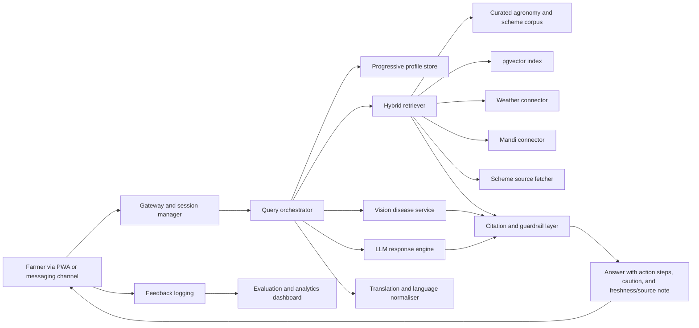
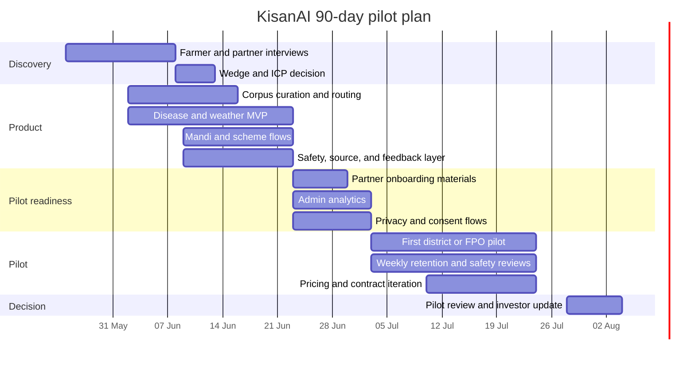

# KisanAI Deep Research Report and Investor Q&A Dossier

## Executive summary

KisanAI’s public footprint supports a clear early-stage thesis: build a **vernacular, mobile-first AI agriculture assistant** for Indian farmers that simplifies a set of urgent, recurring jobs—disease triage, weather interpretation, mandi-price context, and government-scheme guidance—inside one low-friction interface. The strongest primary-source evidence is the product’s own site title, which identifies it as an “AI-Powered Agricultural Assistant,” and a public founder post describing the product’s intended capabilities and current stack. The founder post explicitly says KisanAI aims to answer farming questions in regional languages, detect crop diseases from images, surface mandi prices and hyper-local weather, and simplify scheme discovery; it also states the current stack includes Next.js, Cloudflare Workers, PostgreSQL, and a multilingual model pipeline. ([KisanAI site](https://kishanai.strivio.world/); [Founder post on Reddit](https://www.reddit.com/r/alphaandbetausers/comments/1pcztvu/im_building_an_aipowered_agriculture_assistant/))

The problem is real and economically meaningful. Public reporting shows farmers already lose time and money when digital procurement or advisory systems are confusing, incomplete, or operationally unreliable. Coverage of the Kisan Kapas procurement app described farmers unable to understand documentation requirements, unable to add land details, and encountering blank sections. Separate reporting on cotton procurement failures described repeated trips to local government offices and pressure to sell below MSP. Reporting on onion crop losses described farmers already spending heavily per acre and then facing ruinous losses after weather and disease shocks. This is exactly the kind of high-stakes, fragmented, multilingual decision environment where a trustworthy assistant can create value. ([Times of India on Kisan Kapas app issues](https://timesofindia.indiatimes.com/city/nagpur/after-tariff-jolt-cotton-farmers-struggle-with-kisan-kapas-app/articleshow/124167831.cms); [Times of India on procurement failures in Andhra Pradesh](https://timesofindia.indiatimes.com/city/vijayawada/ccis-app-failures-push-cotton-farmers-to-private-traders-in-ap/articleshow/125139715.cms); [Times of India on onion crop losses](https://timesofindia.indiatimes.com/city/hubballi/onion-crop-loss-over-heavy-rains-leaves-farmers-in-tears/articleshow/123723965.cms))

The market backdrop is supportive. India’s digital agriculture space is active: the Union agriculture ministry launched Bharat-VISTAAR, a multilingual AI tool for digital advisories; Bayer stated its FarmRise app crossed 5 million users; Reuters reported measurable profit improvements from Cropin-led digital advisory deployments; and PM-KISAN beneficiary counts show the scale of addressable farmers already linked to digital public infrastructure. Together, these signals support the claim that the user need is large, digital adoption is real, and a software layer can matter commercially—if distribution and trust are solved. ([Times of India on Bharat-VISTAAR](https://timesofindia.indiatimes.com/india/agriculture-ministry-launches-bharat-vistaar-a-multilingual-ai-tool-for-digital-fam-advisories/articleshow/128472775.cms); [Economic Times on FarmRise reaching 5 million users](https://m.economictimes.com/news/economy/agriculture/bayer-strengthens-its-phygital-connect-with-indian-farmers-as-farmrise-app-reaches-5-million-users/articleshow/131060228.cms); [Reuters on Cropin and space-data farming outcomes](https://www.reuters.com/world/india/space-data-fuels-indias-farming-innovation-drive-2024-05-17/); [Times of India on PM-KISAN instalment beneficiaries](https://timesofindia.indiatimes.com/city/varanasi/modi-to-release-20th-installment-of-pm-kisan-from-varanasi-today/articleshow/123049083.cms))

At the same time, KisanAI is **not yet investable on public evidence alone**. The site and linked public materials do not establish founder credentials, traction, retention, distribution partnerships, legal posture, or a validated revenue model. That does not mean the opportunity is weak. It means the immediate task is not “add everything”; it is to narrow the wedge, prove retention in one crop cluster and one channel, and document economics and trust. Based on the public evidence reviewed, KisanAI’s best near-term strategy is **B2B2C distribution first**—through FPOs, NGOs, KVK-linked pilots, or agri-input partners—before betting heavily on direct paid B2C adoption. ([KisanAI site](https://kishanai.strivio.world/); [Founder post on Reddit](https://www.reddit.com/r/alphaandbetausers/comments/1pcztvu/im_building_an_aipowered_agriculture_assistant/); [Economic Times on FarmRise scale](https://m.economictimes.com/news/economy/agriculture/bayer-strengthens-its-phygital-connect-with-indian-farmers-as-farmrise-app-reaches-5-million-users/articleshow/131060228.cms))

This report therefore does two things. First, it reconstructs the startup thesis, market, product plan, economics, and risk profile from the public footprint around KisanAI and the wider Indian agri-advisory market. Second, it adds an **investor Q&A brief** that classifies likely investor questions into lower-signal, common, and high-impact questions, and gives concise, evidence-backed responses that can be translated directly into pitch slides and talking points. Where information is not visible publicly, it is marked **unspecified** and paired with concrete next steps to validate it. ([KisanAI site](https://kishanai.strivio.world/); [Founder post on Reddit](https://www.reddit.com/r/alphaandbetausers/comments/1pcztvu/im_building_an_aipowered_agriculture_assistant/))

## Crawl findings and startup thesis

### What was publicly fetchable

The KisanAI website is a JavaScript-heavy app. The publicly retrievable metadata from the root page exposed the title “KisanAI - India’s First AI-Powered Agricultural Assistant,” and an indexed `/application` route was visible as well. However, within the browsing constraints of the reviewed materials, the fully rendered page body text was not accessible for extraction. A public YouTube handle was surfaced during discovery, and a public Reddit post from the project’s creator supplied the most detailed externally accessible description of features and stack. Because of these rendering limits, this report prioritises visible site metadata, public linked mentions, and external primary and near-primary sources. ([KisanAI site](https://kishanai.strivio.world/); [KisanAI application route](https://kishanai.strivio.world/application); [Founder post on Reddit](https://www.reddit.com/r/alphaandbetausers/comments/1pcztvu/im_building_an_aipowered_agriculture_assistant/))

### Founder clarity assessment

The table below separates what is already supported by public evidence from what remains unverified.

| Founder clarity dimension | Current assessment | Evidence | Status |
|---|---|---|---|
| One-line vision | AI assistant for Indian farmers | Site title and public founder description | Partly explicit |
| Target customer | Indian farmers, especially those needing simple local-language help | Founder post emphasises regional-language help and farmer problems | Partly explicit |
| Problem | Fragmented, complex, often non-vernacular agricultural information and workflows | Public founder statement; public reporting on broken apps and information friction | Strong |
| Why now | Rising digital agriculture activity, multilingual AI maturity, large farmer user base already linked to digital systems | Bharat-VISTAAR launch, FarmRise scale, PM-KISAN reach | Strong externally, weakly stated on-site |
| Unfair advantage | Not visible publicly | No clear evidence of proprietary data, distribution moat, or unique founder-market fit | Unspecified |
| Wedge | Broad assistant across disease, weather, prices, schemes | Public founder post lists several adjacent modules | Too broad |
| Exclusions | What KisanAI will not do is not stated | No public scope boundaries visible | Unspecified |

Sources: [KisanAI site](https://kishanai.strivio.world/); [Founder post on Reddit](https://www.reddit.com/r/alphaandbetausers/comments/1pcztvu/im_building_an_aipowered_agriculture_assistant/); [Times of India on Kisan Kapas app issues](https://timesofindia.indiatimes.com/city/nagpur/after-tariff-jolt-cotton-farmers-struggle-with-kisan-kapas-app/articleshow/124167831.cms)

### Recommended sharpened positioning

A better public positioning statement for the product would be:

> **KisanAI helps small and lower-digital-literacy Indian farmers take better daily crop decisions in their own language through one assistant for disease triage, weather-to-action, mandi-price context, and scheme guidance.**

That wording is more investable because it sharpens the user, the job to be done, the trust trigger, and the daily utility loop. It also implies useful exclusions: KisanAI is not initially a trading exchange, full ERP, credit product, or “everything for every farmer” platform. This is a strategic recommendation inferred from the current public evidence and the competitive landscape, not a published company statement. ([Founder post on Reddit](https://www.reddit.com/r/alphaandbetausers/comments/1pcztvu/im_building_an_aipowered_agriculture_assistant/); [Times of India on Bharat-VISTAAR](https://timesofindia.indiatimes.com/india/agriculture-ministry-launches-bharat-vistaar-a-multilingual-ai-tool-for-digital-fam-advisories/articleshow/128472775.cms))

## Customer problem, ICP, and market

### Problem research with extracted pain signals

The public evidence reviewed points to a pattern: agricultural decisions are high stakes, but the information channels available to farmers are fragmented, unreliable, or too complex to use confidently. The following pain statements are especially relevant because they map directly to the kinds of flows KisanAI is trying to simplify.

| Pain theme | Extracted quote | Implication for KisanAI | Source |
|---|---|---|---|
| Registration complexity | “Can't understand which document is needed for registration” | Reduce required inputs; use guided checklists in plain language | [Times of India, Kisan Kapas](https://timesofindia.indiatimes.com/city/nagpur/after-tariff-jolt-cotton-farmers-struggle-with-kisan-kapas-app/articleshow/124167831.cms) |
| Broken interfaces | “The agriculture produce marketing committee (APMC) section is blank” | Reliability matters as much as intelligence | [Times of India, Kisan Kapas](https://timesofindia.indiatimes.com/city/nagpur/after-tariff-jolt-cotton-farmers-struggle-with-kisan-kapas-app/articleshow/124167831.cms) |
| Data-entry friction | “I tried to add land details but couldn't. Worst experience ever” | Progressive profiling beats long onboarding | [Times of India, Kisan Kapas](https://timesofindia.indiatimes.com/city/nagpur/after-tariff-jolt-cotton-farmers-struggle-with-kisan-kapas-app/articleshow/124167831.cms) |
| Operational failure cost | Farmers were “forced to make repeated trips to village secretariats” | Assistance has to reduce physical trips, not create them | [Times of India, Andhra procurement failures](https://timesofindia.indiatimes.com/city/vijayawada/ccis-app-failures-push-cotton-farmers-to-private-traders-in-ap/articleshow/125139715.cms) |
| Distress from crop loss | “Now, I am facing a big loss and I'm in debt” | Disease and weather advice have direct economic value | [Times of India, onion crop losses](https://timesofindia.indiatimes.com/city/hubballi/onion-crop-loss-over-heavy-rains-leaves-farmers-in-tears/articleshow/123723965.cms) |
| Severe financial consequence | “I have no other option but to sell my land to repay the loan” | Trust and timeliness are existential, not cosmetic | [Times of India, onion crop losses](https://timesofindia.indiatimes.com/city/hubballi/onion-crop-loss-over-heavy-rains-leaves-farmers-in-tears/articleshow/123723965.cms) |

These public pain points support six product principles: default local language, voice and image input, very low onboarding friction, explicit source and freshness labels, step-by-step action guidance rather than generic text, and graceful abstention when certainty is low. Those principles are also consistent with recent Indian agri-AI research, which emphasises the importance of multilingual support, retrieval quality, and interface design rather than just model sophistication. ([ArXiv on agricultural disease-detection app review](https://arxiv.org/abs/2208.02446); [ArXiv on multilingual agri-QA systems](https://arxiv.org/abs/2508.03719); [ArXiv on agricultural AI extension platforms](https://arxiv.org/abs/2601.11537))

### Existing workarounds and substitutes

Farmers already combine local dealers, neighbours, extension officers, mandi agents, government portals, WhatsApp groups, and existing agri apps to answer these questions. This means KisanAI is not entering a greenfield market. It is competing with **human networks plus fragmented digital substitutes**. Government systems such as eNAM already support electronic agricultural marketing; older multilingual farmer Q&A projects such as aAQUA show the longstanding need for local-language advisory; and current digital-agriculture companies such as Plantix, DeHaat, FarmRise, and Cropin each occupy part of the workflow. The practical question is therefore not “can software help farmers?”—that is already proven—but “can KisanAI become the simplest trusted wrapper around multiple daily information jobs?” ([eNAM overview](https://en.wikipedia.org/wiki/E-NAM); [aAQUA overview](https://en.wikipedia.org/wiki/Aaqua); [Plantix overview](https://en.wikipedia.org/wiki/Plantix); [DeHaat overview](https://en.wikipedia.org/wiki/DeHaat))

### Trigger moments, urgency, and willingness to pay

KisanAI’s real opportunity sits in high-frequency or high-stakes trigger moments: a new leaf symptom, sudden rainfall, a mandi visit, a scheme deadline, or an input purchase decision. Public reporting shows the economic downside of making the wrong call at these moments can be very high. For instance, one onion grower cited in reporting said he spent about ₹80,000 per acre and was then unable to recover his cost when disease and rainfall damaged the crop. That scale of downside makes advisory value intuitively monetisable. ([Times of India, onion crop losses](https://timesofindia.indiatimes.com/city/hubballi/onion-crop-loss-over-heavy-rains-leaves-farmers-in-tears/articleshow/123723965.cms))

Direct farmer willingness to pay for **KisanAI specifically** is not publicly proven. However, willingness to pay for adjacent value is visible in the broader market. Plantix monetises via input-linked commerce; Cropin monetises through enterprise agronomy and analytics; DeHaat has grown a large services-and-inputs business; and Bayer reports very large user adoption for FarmRise. That suggests value is real, but it may monetise most cleanly at first through **B2B2C contracts, partner distribution, or commerce-adjacent models** rather than pure B2C subscription from day one. ([Plantix overview](https://en.wikipedia.org/wiki/Plantix); [Reuters on Cropin outcomes](https://www.reuters.com/world/india/space-data-fuels-indias-farming-innovation-drive-2024-05-17/); [DeHaat overview](https://en.wikipedia.org/wiki/DeHaat); [Economic Times on FarmRise 5 million users](https://m.economictimes.com/news/economy/agriculture/bayer-strengthens-its-phygital-connect-with-indian-farmers-as-farmrise-app-reaches-5-million-users/articleshow/131060228.cms))

### Inferred ICP and customer research plan

Based on the public product description and wider market evidence, the best initial ICP is not “all Indian farmers.” It is **farmers or farmer-family decision helpers in one crop cluster, one geography, one dominant language, and one channel-led distribution motion**. That is how KisanAI can concentrate product quality, knowledge-base coverage, and partner acquisition economics early. This inference is consistent with public agri-AI research that repeatedly points out the importance of local context, language handling, and curated domain knowledge for practical adoption. ([Founder post on Reddit](https://www.reddit.com/r/alphaandbetausers/comments/1pcztvu/im_building_an_aipowered_agriculture_assistant/); [ArXiv on agricultural AI extension platforms](https://arxiv.org/abs/2601.11537))

A concrete ICP hypothesis and research plan:

| Dimension | Recommended starting point | Why |
|---|---|---|
| Crop cluster | Cotton, onion, chilli, tomato, soybean, or paddy | High disease risk, price sensitivity, and recurring decisions |
| Geography | One state, then one agro-climatic belt inside it | Easier localisation of language, weather, scheme content, and mandi data |
| User | Farmer or family member aged roughly 20–45 with smartphone access | Higher probability of repeated digital use |
| Language | One primary regional language plus Hindi and English fallback | Improves trust and activation |
| Channel | WhatsApp, Telegram, or PWA | Lower install and re-engagement friction than app stores |
| First buyer | FPO, NGO, agri-input retailer, or institutional pilot | Lower CAC and faster usage concentration |

| Research motion | Target count | Purpose |
|---|---:|---|
| Farmer interviews | 25–30 | Identify recurring jobs, trigger moments, and trust barriers |
| FPO/NGO interviews | 5–8 | Validate distribution model and admin-reporting needs |
| Retailer/dealer interviews | 8–10 | Understand competing advice channels and commerce hooks |
| KVK/extension expert interviews | 5–8 | Validate disease/scheme/weather workflows and escalation boundaries |
| Field shadowing | 10 farmer workflows | Observe actual usage context, literacy, family-assisted use, and network constraints |

The most important question to validate is not “would you use AI?” It is “what exactly happened the last time you had a crop problem, where did you go first, how long did it take, and what did it cost you?” That is the question that reveals workflow value instead of polite enthusiasm. This is an inference based on startup best practice applied to the observed agricultural pain patterns. ([Times of India, Kisan Kapas issues](https://timesofindia.indiatimes.com/city/nagpur/after-tariff-jolt-cotton-farmers-struggle-with-kisan-kapas-app/articleshow/124167831.cms); [Times of India, Andhra procurement failures](https://timesofindia.indiatimes.com/city/vijayawada/ccis-app-failures-push-cotton-farmers-to-private-traders-in-ap/articleshow/125139715.cms))

### Market size, assumptions, and trend evidence

A startup-usable TAM/SAM/SOM should begin with a realistic farmer base rather than inflated macro agriculture numbers. One conservative anchor is the PM-KISAN base. Public reporting around the twentieth instalment said the programme was reaching about **9.7 crore farmers**, which is a useful proxy for a large digitally identifiable farmer beneficiary base. To approximate a software market, we can then apply a reachable digital-user ratio and a modest annual revenue per farmer or per covered user. ([Times of India on PM-KISAN beneficiaries](https://timesofindia.indiatimes.com/city/varanasi/modi-to-release-20th-installment-of-pm-kisan-from-varanasi-today/articleshow/123049083.cms))

#### TAM, SAM, SOM model

| Layer | Assumption | Calculation | Annual value assumption | Output |
|---|---|---:|---:|---:|
| TAM | 9.7 crore PM-KISAN-linked farmers | 97,000,000 farmers | ₹600 per farmer/year | ₹58.2 billion |
| SAM | 45% are realistically reachable for smartphone-assisted vernacular digital advisory in the near term | 97,000,000 × 45% | ₹600 per farmer/year | ₹26.19 billion |
| SOM | 0.5% of SAM captured within three years through pilots and partners | 43,650,000 × 0.5% | ₹600 per farmer/year | ₹130.95 million |

This is an **assumption-led planning model**, not an audited market size. The reason it is useful is that it is conservative, explicit, and pitchable: it starts from a large public farmer base, applies a reachability discount, and uses a modest revenue figure that is far below the value at stake in the crop-decision problems being targeted. ([Times of India on PM-KISAN beneficiaries](https://timesofindia.indiatimes.com/city/varanasi/modi-to-release-20th-installment-of-pm-kisan-from-varanasi-today/articleshow/123049083.cms); [Times of India on onion crop losses](https://timesofindia.indiatimes.com/city/hubballi/onion-crop-loss-over-heavy-rains-leaves-farmers-in-tears/articleshow/123723965.cms))

#### Trend evidence supporting the market thesis

| Trend | Why it matters | Evidence |
|---|---|---|
| Government is entering AI advisory | Confirms the category is strategically important and publicly legible | [Bharat-VISTAAR launch](https://timesofindia.indiatimes.com/india/agriculture-ministry-launches-bharat-vistaar-a-multilingual-ai-tool-for-digital-fam-advisories/articleshow/128472775.cms) |
| Existing agri apps can scale | Shows digital adoption among farmers is already happening | [FarmRise 5 million users](https://m.economictimes.com/news/economy/agriculture/bayer-strengthens-its-phygital-connect-with-indian-farmers-as-farmrise-app-reaches-5-million-users/articleshow/131060228.cms) |
| Data-led advisory can improve outcomes | Strengthens the value proposition for digital recommendations | [Reuters on Cropin](https://www.reuters.com/world/india/space-data-fuels-indias-farming-innovation-drive-2024-05-17/) |
| Multilingual AI is becoming a practical build path | Reduces technical barrier to serving diverse Indian language users | [Founder post on current multilingual stack](https://www.reddit.com/r/alphaandbetausers/comments/1pcztvu/im_building_an_aipowered_agriculture_assistant/); [ArXiv agri-QA systems](https://arxiv.org/abs/2508.03719) |
| Digital beneficiary rails already exist | Makes user identity, segmentation, and partner integration easier | [PM-KISAN beneficiary scale](https://timesofindia.indiatimes.com/city/varanasi/modi-to-release-20th-installment-of-pm-kisan-from-varanasi-today/articleshow/123049083.cms) |

### Competitor analysis matrix

KisanAI’s competitive set includes direct agri-AI products, government tools, and important substitutes.

| Competitor / substitute | Core offer | Strengths | Weaknesses | Public complaint / risk signal | Strategic implication for KisanAI |
|---|---|---|---|---|---|
| Plantix | Plant disease detection + advisory | Strong disease-identification brand; category recognition | Can be perceived as input- or pesticide-linked rather than neutral | Public criticism has focused on monetisation and pesticide-selling incentives; academic reviews say disease apps still need improvement | Win on neutrality, local context, and broader assistant workflow ([Plantix](https://en.wikipedia.org/wiki/Plantix); [Wired on Plantix and pesticide concerns](https://www.wired.com/story/plantix-app-agriculture-india-ai/); [ArXiv review of plant disease apps](https://arxiv.org/abs/2208.02446)) |
| Cropin | Enterprise agronomy and intelligence | Strong enterprise proof; measurable farm-impact stories | Enterprise-first, less like a lightweight farmer assistant | Biggest risk is not UX but institutional strength and partner relationships | Avoid competing head-on at the enterprise-analytics layer early ([Reuters on Cropin](https://www.reuters.com/world/india/space-data-fuels-indias-farming-innovation-drive-2024-05-17/)) |
| DeHaat | End-to-end agritech services | Scale, multiple monetisation lines, deep local operations | Broad operational model can make focus harder | Public complaint data not surfaced in reviewed sources; complexity risk remains | KisanAI can position as the low-friction assistant layer ([DeHaat](https://en.wikipedia.org/wiki/DeHaat)) |
| Bayer FarmRise | Digital farmer app | Large installed base, credible distribution | Corporate ecosystem may not feel neutral to all users | No major public complaint surfaced in reviewed material; strategic risk is distribution power | Proves digital adoption and raises the bar on polish ([Economic Times on FarmRise](https://m.economictimes.com/news/economy/agriculture/bayer-strengthens-its-phygital-connect-with-indian-farmers-as-farmrise-app-reaches-5-million-users/articleshow/131060228.cms)) |
| Bharat-VISTAAR | Government AI advisory | Massive legitimacy and public-sector relevance | Unknown UX quality; broad national mandate can slow local sharpness | Too early for broad user complaint evidence | KisanAI should be pilot-friendly and interoperable, not positioned as anti-government ([Times of India on Bharat-VISTAAR](https://timesofindia.indiatimes.com/india/agriculture-ministry-launches-bharat-vistaar-a-multilingual-ai-tool-for-digital-fam-advisories/articleshow/128472775.cms)) |
| eNAM | Market access and price discovery | Established government-backed market infrastructure | Not designed as a conversational farmer assistant | Often mediated by traders or agents rather than fully independent farmer use | KisanAI can summarise and interpret market data rather than replace exchanges ([eNAM](https://en.wikipedia.org/wiki/E-NAM)) |
| aAQUA | Multilingual agricultural Q&A | Longstanding proof that farmers need question-answer support | Forum/expert model can be slower and harder to scale | Old interaction model, not instant or multimodal by modern standards | Strong precedent for local-language advisory demand ([aAQUA](https://en.wikipedia.org/wiki/Aaqua)) |
| Kisan Kapas app | Government procurement app | Illustrates digitised farmer processes at scale | Publicly reported UX and reliability failures | Blank sections, unclear registrations, failed land-detail flows | This is the strongest “what not to do” lesson for KisanAI ([Times of India on Kisan Kapas app issues](https://timesofindia.indiatimes.com/city/nagpur/after-tariff-jolt-cotton-farmers-struggle-with-kisan-kapas-app/articleshow/124167831.cms)) |
| KissanAI | Separate agri AI startup | Agriculture-specific AI ambition and public visibility | Different product, different team; likely platform-heavy | Competitive risk is mindshare and institutional backing | KisanAI must clearly distinguish brand and positioning ([AI in India roundup mentioning KissanAI](https://en.wikipedia.org/wiki/Artificial_intelligence_in_India)) |

### Solution mapping

| User problem | Current bad solution | KisanAI feature | Success metric |
|---|---|---|---|
| New crop symptom appears | Dealer advice, guessing, late expert visit | Image-based possible disease triage with caution and next steps | Scan completion rate; repeat scans; user-reported action taken |
| Weather forecast is generic | Raw weather apps without farm action context | Weather-to-action advice in local language | Open rate; next-day revisit; alert usefulness rating |
| Farmer sees price but not context | Raw mandi numbers, agent hearsay | District-aware mandi-price summary and freshness stamp | Price-check frequency around market days |
| Scheme guidance is bureaucratic | PDF, office visit, agent mediation | Plain-language scheme explainer and document checklist | Scheme-page completion rate; follow-up intent |
| Onboarding is too hard | Forms and land-entry friction | No-mandatory-profile mode and progressive profiling | Activation rate; day-7 retention |

This mapping is derived from the public feature description of KisanAI and the types of failure publicly seen in adjacent farmer apps. ([Founder post on Reddit](https://www.reddit.com/r/alphaandbetausers/comments/1pcztvu/im_building_an_aipowered_agriculture_assistant/); [Times of India on Kisan Kapas app issues](https://timesofindia.indiatimes.com/city/nagpur/after-tariff-jolt-cotton-farmers-struggle-with-kisan-kapas-app/articleshow/124167831.cms))

## Product, technology, economics, and operations

### Recommended MVP scope

The public product narrative is already broader than what an early startup should try to operationalise perfectly. The best MVP is not “all modules at national scale.” It is a **narrow assistant with a small but reliable set of jobs**.

| Build now | Defer |
|---|---|
| One primary regional language plus Hindi/English fallback | Many-language surface area on day one |
| Text + image-based assistant in one crop cluster | Broad crop coverage nationwide |
| Disease triage with “possible issue” framing | Definitive diagnosis claims |
| Weather-to-action cards for selected districts | Full climatology or long-term farm planning |
| Mandi-price summaries with freshness labels | National all-market aggregation if data quality is inconsistent |
| Scheme explainer with source links and disclaimers | End-to-end application execution |
| PWA or WhatsApp/Telegram entry | App-store-led growth as the only channel |

This scope reduces hallucination risk, support burden, and content-maintenance cost while maximising learnings around retention and trust. Recent agricultural AI research supports the value of focused domain corpora, query routing, and grounded output over broad general-purpose chat. ([ArXiv on agricultural AI extension platforms](https://arxiv.org/abs/2601.11537); [ArXiv on multilingual agri-QA systems](https://arxiv.org/abs/2508.03719))

### Recommended tech stack and architecture

The founder’s public stack choices are already sensible for an MVP: Next.js, Cloudflare Workers, PostgreSQL, and a multilingual model pipeline. The missing ingredients are architecture discipline, retrieval grounding, and safety instrumentation. ([Founder post on Reddit](https://www.reddit.com/r/alphaandbetausers/comments/1pcztvu/im_building_an_aipowered_agriculture_assistant/))

| Layer | Recommendation | Rationale | Source / basis |
|---|---|---|---|
| Front end | Next.js PWA | Good mobile web experience without forcing installs | [Founder post on current stack](https://www.reddit.com/r/alphaandbetausers/comments/1pcztvu/im_building_an_aipowered_agriculture_assistant/) |
| Edge/API | Cloudflare Workers | Low-latency edge logic and cache control | [Founder post on current stack](https://www.reddit.com/r/alphaandbetausers/comments/1pcztvu/im_building_an_aipowered_agriculture_assistant/) |
| DB | Postgres with `pgvector` to start | Cheaper and simpler than specialised vector DBs at early scale | [Founder post on current stack](https://www.reddit.com/r/alphaandbetausers/comments/1pcztvu/im_building_an_aipowered_agriculture_assistant/); [Pinecone pricing](https://www.pinecone.io/pricing/); [Neon pricing](https://neon.com/pricing) |
| Object storage | Cloudflare R2 | Cheap storage, egress advantages, good fit for images/docs | [Cloudflare R2 pricing](https://developers.cloudflare.com/r2/pricing/) |
| LLM layer | Structured generation with tool-use and fallback templates | Needed for mixed tasks like chat, scheme explanation, and summarisation | [OpenAI API pricing](https://openai.com/api/pricing/) |
| Disease model | Dedicated vision model or tuned pipeline | Avoids over-relying on generic chat vision for disease accuracy | [ArXiv review of plant disease apps](https://arxiv.org/abs/2208.02446) |
| Analytics | Full event logging and QA dashboard | Required to learn trust, retention, and error patterns | Recommended from product-operating needs; supported by deployment lessons in [ArXiv agricultural AI platform paper](https://arxiv.org/abs/2601.11537) |

#### Architecture diagram



### Data flow and AI pipeline specifics

A robust KisanAI workflow should follow a simple but safety-conscious path:

1. **Intent detection**: identify whether the query is disease, weather, mandi, scheme, or general agronomy.
2. **Context completion**: ask for missing crop, location, and stage data when necessary.
3. **Retrieval**: pull from a curated domain corpus and live connectors rather than relying on parametric memory alone.
4. **Generation**: structure responses as direct answer, recommended action, why, caution, and source/freshness note.
5. **Abstention and escalation**: where confidence is low or the request is high-risk, recommend KVK or local expert review.
6. **Feedback logging**: record thumbs-up/down, follow-up question, and eventual action if feasible.
7. **Evaluation**: compare outputs against a golden question set by crop, task type, and language.

This architecture is well supported by the direction of current agri-AI work in India, which emphasises multilingual query understanding, curated knowledge, retrieval-backed answer generation, and multi-turn interaction design. ([ArXiv on multilingual agri-QA systems](https://arxiv.org/abs/2508.03719); [ArXiv on agricultural AI extension platforms](https://arxiv.org/abs/2601.11537))

#### AI pipeline recommendations

| Pipeline stage | Recommended approach | Why |
|---|---|---|
| Ingestion | Official agriculture pages, KVK advisories, state dept pages, vetted crop guides, selected partner content | Better grounding and defensibility |
| Chunking | 600–900 tokens with metadata for crop, region, date, source type, and language | Balances recall and context |
| Retrieval | Hybrid lexical + vector + reranking by crop/location/date relevance | Pure vector retrieval is often too fuzzy for domain tasks |
| Vector DB | `pgvector` initially, specialist vector DB later if needed | Lower cost and operational complexity early |
| Hallucination control | Strict source-backed outputs, freshness TTLs, banned unsupported claims, explicit uncertainty | Essential for high-stakes farm decisions |
| Evaluation | Grounded answer rate, source-hit rate, false-advice rate, abstention quality, language adequacy | Product quality must be measurable |

### Cost estimates per active user

The cost table below is **illustrative**, built from public vendor pricing and simple usage assumptions. It is useful for investor conversations because it shows that token cost is probably **not** the main economic bottleneck early; distribution, support, and trust are.

Public pricing anchors used: OpenAI API pricing, Vercel pricing, Cloudflare R2 pricing, Neon pricing, and Pinecone pricing. ([OpenAI API pricing](https://openai.com/api/pricing/); [Vercel pricing](https://vercel.com/pricing); [Cloudflare R2 pricing](https://developers.cloudflare.com/r2/pricing/); [Neon pricing](https://neon.com/pricing); [Pinecone pricing](https://www.pinecone.io/pricing/))

| Usage scenario | Assumptions | AI cost / active user / month | Storage + hosting / active user / month | Blended total / active user / month |
|---|---|---:|---:|---:|
| Text-only light | 10 queries/month; ~2,000 input + 400 output tokens/query | ~$0.03–0.04 | ~$0.01 | **~$0.04–0.05** |
| Text + disease assist | 10 text queries + 2 image/disease runs | ~$0.04–0.07 | ~$0.01–0.02 | **~$0.05–0.09** |
| Voice-heavy advisory | Multiple voice interactions + text + some vision | ~$0.08–0.15 | ~$0.01–0.03 | **~$0.09–0.18** |

These ranges are assumption-driven. The correct interpretation is not the absolute numbers but the shape of the economics: low-cost digital advisory is plausible, especially if KisanAI keeps heavy model calls limited and leans on retrieval, templates, caching, and messaging-first interfaces. ([OpenAI API pricing](https://openai.com/api/pricing/); [Cloudflare R2 pricing](https://developers.cloudflare.com/r2/pricing/))

### Security, privacy, and compliance checklist

KisanAI is likely to process phone numbers, approximate or exact locations, crop data, interaction history, and uploaded field images. That makes privacy and safety a product requirement, not an afterthought. India’s Digital Personal Data Protection framework is therefore relevant. For global pilots or institutional partners, GDPR-style expectations around purpose limitation, consent, retention, and deletion may also arise. This section is directional and not legal advice. ([DPDP Act overview](https://en.wikipedia.org/wiki/Digital_Personal_Data_Protection_Act%2C_2023))

| Compliance area | Minimum requirement |
|---|---|
| Consent | Plain-language consent in user language; separate consent for image upload, location, and marketing |
| Data minimisation | Do not require land records or identity documents for basic advisory |
| Retention | Publish how long chats, images, and profile data are kept |
| Security | Encryption in transit and at rest, role-based access, audit logs, vendor controls |
| Children | Do not assume independent child users; if minors may interact, avoid profiling and design conservatively |
| Breach response | Internal incident playbook and vendor notification process |
| Advice safety | Strong disclaimer plus escalation for risky disease or chemical queries |
| Sources | Show freshness and provenance for scheme and mandi data where possible |
| Open-source / model governance | Track datasets, model versions, prompts, and rollback capability |

One important limitation: the reviewed public materials do **not** prove how much child- or family-assisted usage is happening in farm households. Investors may ask about this. The right answer is that rural and vernacular digital adoption is clearly real, but the **exact household usage pattern for KisanAI’s ICP is a pilot question to validate**, not something to bluff. That is a stronger answer than inventing a number without evidence. ([Economic Times on FarmRise 5 million users](https://m.economictimes.com/news/economy/agriculture/bayer-strengthens-its-phygital-connect-with-indian-farmers-as-farmrise-app-reaches-5-million-users/articleshow/131060228.cms))

### Business model, pricing tests, and unit economics

The current public evidence does not show that KisanAI has chosen a final revenue model. The market suggests a staged approach is best.

| Stage | Model | Indicative pricing | Why it fits |
|---|---|---|---|
| Early | B2B2C pilot via FPO / NGO / partner | ₹15–30 per covered farmer per month on pilot or annual contract | Lower CAC; easier to concentrate usage |
| Validation | Freemium plus premium advisory | Free core; ₹49/month or ₹399–699/year premium | Useful only after trust and habit are proven |
| Growth | Enterprise / API / white-label layer | Custom contract pricing | Better for institutional budgets and predictable revenue |
| Adjacency | Commerce or referral on verified services | Revenue share or lead-gen | Only once trust and neutrality rules are defined |

This staging is grounded in the observable ways adjacent companies monetise today. Plantix and DeHaat monetise through broader agricultural value flows, while Cropin monetises through enterprise value creation; a pure farmer-subscription play may still work, but it is not the only or safest first bet. ([Plantix](https://en.wikipedia.org/wiki/Plantix); [DeHaat](https://en.wikipedia.org/wiki/DeHaat); [Reuters on Cropin](https://www.reuters.com/world/india/space-data-fuels-indias-farming-innovation-drive-2024-05-17/))

#### Unit economics scenarios

| Scenario | ARPA / year | Gross margin assumption | Retention assumption | LTV | CAC | LTV/CAC |
|---|---:|---:|---:|---:|---:|---:|
| Consumer low-price annual | ₹399 | 75% | 1.5 years | ₹449 | ₹250 | 1.8x |
| Consumer stronger annual | ₹699 | 80% | 2 years | ₹1,118 | ₹300 | 3.7x |
| B2B2C partner contract | ₹216 | 85% | 3 years | ₹551 | ₹120 | 4.6x |
| Enterprise / institutional | ₹500,000 | 90% | 2 years | ₹900,000 | ₹150,000 | 6.0x |

These are **scenario models**, not observed KisanAI data. The strategic lesson is more important than the exact values: if KisanAI acquires users directly, consumer economics only work with strong retention and very low acquisition cost; if it sells through institutions, the economics become plausible much earlier. That is why the pilot and GTM design matter more than shaving a few cents off token spend. ([Economic Times on FarmRise adoption](https://m.economictimes.com/news/economy/agriculture/bayer-strengthens-its-phygital-connect-with-indian-farmers-as-farmrise-app-reaches-5-million-users/articleshow/131060228.cms); [OpenAI pricing](https://openai.com/api/pricing/))

## Go-to-market, fundraising narrative, and investor Q&A

### Go-to-market strategy and launch plan

KisanAI’s GTM should be **partner-led, localised, and operationally simple**. The strongest channels are those that already aggregate farmers and have a reason to improve advisory quality or engagement.

| Channel | Recommended tactic | Why |
|---|---|---|
| FPOs and cooperatives | Pilot with one FPO per district and one crop cluster | Lowers CAC and concentrates behaviour |
| NGOs and livelihood programmes | Bundle the assistant into climate-resilience or advisory initiatives | Good for pilot learning and impact proof |
| KVK and extension events | Demo disease triage and weather-to-action flows in person | Builds trust and creates grounded feedback |
| Agri-input retailers | QR-based or assisted onboarding at purchase moment | Reaches users at high-intent decision points |
| WhatsApp / Telegram groups | Shareable advisory cards and question flows | Reduces install friction and supports virality |
| Vernacular video content | Crop-stage and weather explainers | Trust-building and acquisition in local languages |

The likely growth loop is:

**Farmer asks → gets useful sourced answer → shares advisory card or screenshot → new user discovers → assisted onboarding → returns at next trigger moment.**

That loop is much more plausible than a generic paid-ads-led “download the app” motion. It is also consistent with the product’s current messaging-first character and the large amount of behavioural friction visible in broken agricultural apps. ([Founder post on Reddit](https://www.reddit.com/r/alphaandbetausers/comments/1pcztvu/im_building_an_aipowered_agriculture_assistant/); [Times of India on Kisan Kapas app issues](https://timesofindia.indiatimes.com/city/nagpur/after-tariff-jolt-cotton-farmers-struggle-with-kisan-kapas-app/articleshow/124167831.cms))

#### Launch timeline



### Legal and finance checklist for India and international readiness

| Area | India-first checklist | International extension |
|---|---|---|
| Entity and founders | Clean cap table, founders’ agreement, IP assignment, contractor agreements | Prepare for cross-border contracting and possible holding-structure decisions |
| Startup eligibility | Assess Startup India / DPIIT recognition eligibility and benefits | Helpful for signalling, but not a substitute for customer proof |
| Tax and accounting | GST, bookkeeping, invoice discipline, grant/pilot tracking | Multi-currency contract process for international pilots |
| Privacy | DPDP-aligned notices and data-handling records | GDPR-style consent, deletion, and DPA readiness |
| Product claims | Avoid false affiliation, false certification, or unsupported yield/improvement claims | Needed for institutional due diligence everywhere |
| Sector risk | Do not present the product as a regulated expert substitute for high-risk advice without controls | Add contractual liability limitations where appropriate |

Public information on Startup India recognises innovation-led startups under certain age and turnover thresholds and provides scheme-related benefits through the Startup India ecosystem. That can support KisanAI’s public-sector credibility, but it is a secondary lever after actual pilot evidence. ([Startup India overview](https://en.wikipedia.org/wiki/Startup_India))

### Fundraising narrative and pitch-deck structure

The most convincing pitch deck for KisanAI would be **evidence-heavy and restraint-heavy**. Investors in this category will care more about trust, channel strategy, and retention than flashy AI language.

| Slide | Recommended message | Supporting evidence to show |
|---|---|---|
| Vision | One trusted assistant for daily farm decisions | Site positioning and product demo ([KisanAI site](https://kishanai.strivio.world/)) |
| Problem | Information is fragmented, urgent, and costly to get wrong | Field pain quotes and adverse workflow examples ([Times of India on Kisan Kapas](https://timesofindia.indiatimes.com/city/nagpur/after-tariff-jolt-cotton-farmers-struggle-with-kisan-kapas-app/articleshow/124167831.cms); [Times of India on onion losses](https://timesofindia.indiatimes.com/city/hubballi/onion-crop-loss-over-heavy-rains-leaves-farmers-in-tears/articleshow/123723965.cms)) |
| Why now | Government AI advisory, scalable agri apps, digital farmer base | Bharat-VISTAAR, FarmRise, PM-KISAN ([Bharat-VISTAAR](https://timesofindia.indiatimes.com/india/agriculture-ministry-launches-bharat-vistaar-a-multilingual-ai-tool-for-digital-fam-advisories/articleshow/128472775.cms); [FarmRise](https://m.economictimes.com/news/economy/agriculture/bayer-strengthens-its-phygital-connect-with-indian-farmers-as-farmrise-app-reaches-5-million-users/articleshow/131060228.cms); [PM-KISAN](https://timesofindia.indiatimes.com/city/varanasi/modi-to-release-20th-installment-of-pm-kisan-from-varanasi-today/articleshow/123049083.cms)) |
| Product | Disease triage, weather-to-action, mandi context, schemes | Demo screenshots and response examples |
| ICP and wedge | Start where retention can be highest | One crop cluster, one region, one partner motion |
| Market | Conservative TAM/SAM/SOM, not inflated agriculture GDP | PM-KISAN-based model |
| Competition | Win on simplicity, trust, and local context | Competitor matrix |
| Business model | B2B2C first, freemium later, enterprise/API possible | Comparable monetisation patterns in market |
| GTM | Partner-led and messaging-first | Pilot plan; channel hypotheses |
| Metrics | Activation, day-7 retention, disease scan completion, partner deployment | Pilot dashboard |
| Team | Founder-market fit and domain access | This is currently unspecified and must be strengthened publicly |
| Ask | Capital for pilot expansion, quality/evaluation, and channel buildout | Use-of-funds table |

### Investor Q&A brief

The tables below list likely investor questions and the most effective concise answers. “Lower-signal” questions are not necessarily stupid; they are simply less decisive than they often sound at KisanAI’s current stage.

#### High-impact investor questions

| Question | Why it matters | Best answer | Evidence / proof to cite | Slide or backup material |
|---|---|---|---|---|
| Why this problem? | Tests whether the pain is real and large | Farmers repeatedly lose time and money because information is fragmented, hard to trust, or operationally broken. Public evidence shows failures in registration flows, procurement apps, and crop-loss decisions. | [Kisan Kapas app issues](https://timesofindia.indiatimes.com/city/nagpur/after-tariff-jolt-cotton-farmers-struggle-with-kisan-kapas-app/articleshow/124167831.cms); [Andhra procurement failures](https://timesofindia.indiatimes.com/city/vijayawada/ccis-app-failures-push-cotton-farmers-to-private-traders-in-ap/articleshow/125139715.cms); [Onion losses](https://timesofindia.indiatimes.com/city/hubballi/onion-crop-loss-over-heavy-rains-leaves-farmers-in-tears/articleshow/123723965.cms) | Problem slide with quotes |
| Why now? | Tests timing | The category is being validated from multiple directions at once: government launched Bharat-VISTAAR, corporates have achieved multi-million farmer app adoption, and AI infrastructure now supports multilingual advisory workflows. | [Bharat-VISTAAR](https://timesofindia.indiatimes.com/india/agriculture-ministry-launches-bharat-vistaar-a-multilingual-ai-tool-for-digital-fam-advisories/articleshow/128472775.cms); [FarmRise 5M users](https://m.economictimes.com/news/economy/agriculture/bayer-strengthens-its-phygital-connect-with-indian-farmers-as-farmrise-app-reaches-5-million-users/articleshow/131060228.cms); [Founder stack description](https://www.reddit.com/r/alphaandbetausers/comments/1pcztvu/im_building_an_aipowered_agriculture_assistant/) | Why-now slide |
| Who is the initial user? | Tests focus | Not “all farmers.” Start with one crop cluster, one geography, one dominant language, and partner-led onboarding through an FPO, NGO, or retailer. | Strategy inferred from public product breadth and market dynamics; supported by local-context needs in [ArXiv agri-QA systems](https://arxiv.org/abs/2508.03719) | ICP slide |
| Why will farmers trust you? | In agri, trust is the moat | Because KisanAI should answer in the user’s language, show source or freshness notes, avoid overclaiming, and escalate when uncertain. Trust is product behaviour, not branding. | Pain evidence from broken apps; platform design lessons from agri-AI papers ([Kisan Kapas issues](https://timesofindia.indiatimes.com/city/nagpur/after-tariff-jolt-cotton-farmers-struggle-with-kisan-kapas-app/articleshow/124167831.cms); [ArXiv AIEP paper](https://arxiv.org/abs/2601.11537)) | Safety and trust slide |
| What is the wedge? | Tests whether the company is focused | The wedge is not “all agriculture.” It is daily decision support around disease, weather, mandi context, and schemes for one cluster where repeat usage is likely. | [Founder feature list](https://www.reddit.com/r/alphaandbetausers/comments/1pcztvu/im_building_an_aipowered_agriculture_assistant/) | Product wedge slide |
| Why can’t Bharat-VISTAAR or FarmRise just do this? | Tests defensibility | They can cover broad advisory territory, but KisanAI can win by being narrower, faster to localise, partner-friendly, and obsessively simple. Government scale and corporate distribution are strengths, but they can also make sharp local product iteration harder. | [Bharat-VISTAAR](https://timesofindia.indiatimes.com/india/agriculture-ministry-launches-bharat-vistaar-a-multilingual-ai-tool-for-digital-fam-advisories/articleshow/128472775.cms); [FarmRise 5M users](https://m.economictimes.com/news/economy/agriculture/bayer-strengthens-its-phygital-connect-with-indian-farmers-as-farmrise-app-reaches-5-million-users/articleshow/131060228.cms) | Competition slide |
| How do you distribute cheaply? | Often the decisive go-to-market question | Through B2B2C pilots with FPOs, NGOs, KVK-linked channels, and retailers. That keeps CAC lower and concentrates use in defined cohorts. | Inference from adjacent scale patterns and unit-economics logic; supported by partner-driven adoption patterns in the sector ([FarmRise scale](https://m.economictimes.com/news/economy/agriculture/bayer-strengthens-its-phygital-connect-with-indian-farmers-as-farmrise-app-reaches-5-million-users/articleshow/131060228.cms)) | GTM slide |
| What is the business model? | Tests monetisation realism | Start with partner contracts and pilot fees; test freemium only after retention is proven. Longer term, enterprise/API and verified service referrals may become higher-value lines. | [Plantix](https://en.wikipedia.org/wiki/Plantix); [DeHaat](https://en.wikipedia.org/wiki/DeHaat); [Reuters on Cropin](https://www.reuters.com/world/india/space-data-fuels-indias-farming-innovation-drive-2024-05-17/) | Business model slide |
| What is the proof farmers can use digital agri products? | Tests adoption assumptions | FarmRise says it has crossed 5 million Indian users, eNAM exists at national scale, and PM-KISAN shows a very large digitally connected beneficiary base; adoption is real, though the right UX still matters hugely. | [FarmRise 5M users](https://m.economictimes.com/news/economy/agriculture/bayer-strengthens-its-phygital-connect-with-indian-farmers-as-farmrise-app-reaches-5-million-users/articleshow/131060228.cms); [eNAM](https://en.wikipedia.org/wiki/E-NAM); [PM-KISAN beneficiaries](https://timesofindia.indiatimes.com/city/varanasi/modi-to-release-20th-installment-of-pm-kisan-from-varanasi-today/articleshow/123049083.cms) | Adoption slide |
| How do you avoid dangerous hallucinations? | High-stakes product risk | Use retrieval-backed answers, strict uncertainty language, source/freshness labels, and escalation to local experts or KVKs for high-risk cases. Do not present disease outputs as definitive diagnoses. | [ArXiv AIEP paper](https://arxiv.org/abs/2601.11537); [ArXiv disease-app review](https://arxiv.org/abs/2208.02446) | Safety architecture slide |
| What is your unfair advantage? | Tests moat | Publicly, this is still unspecified. The honest answer is that the moat must be built through superior trust UX, partner distribution, localised knowledge quality, and proprietary interaction data from pilots. | Public site does not yet establish a moat; this is a critical proof gap ([KisanAI site](https://kishanai.strivio.world/)) | What-we-are-building slide |
| What metrics matter in the first 90 days? | Good investors ask this | Activation, day-7 retention, repeat usage by trigger type, disease scan completion, grounded-answer rate, and partner-level activation. Vanity downloads do not matter. | Product-operations inference supported by the nature of the workflow and trust risk | KPI slide |

#### Common investor questions

| Question | Good concise answer | Evidence / proof | Slide or appendix |
|---|---|---|---|
| How big is the market? | A conservative software TAM can begin from the ~9.7 crore PM-KISAN-linked farmer base and a modest annual advisory value, producing a TAM of ~₹58.2 billion at ₹600/year. | [PM-KISAN beneficiaries](https://timesofindia.indiatimes.com/city/varanasi/modi-to-release-20th-installment-of-pm-kisan-from-varanasi-today/articleshow/123049083.cms) | TAM/SAM/SOM appendix |
| What does SAM look like? | Using a 45% reachability assumption for digitally reachable advisory users yields ~43.65 million in SAM and ~₹26.19 billion annual value at the same pricing assumption. | Planning assumption anchored to PM-KISAN data; limitation should be stated clearly | TAM/SAM/SOM appendix |
| Why B2B2C first instead of direct subscription? | Because direct farmer CAC is harder and trust takes time. Partners can concentrate cohorts, reduce cost, and create better feedback loops. | Supported by adjacent market scaling patterns and unit economics logic | GTM and unit economics slides |
| What will gross margins look like? | Software-gross margins can be high; public infrastructure pricing suggests AI cost can be manageable, often well under a dollar per active user per month in lean usage scenarios. | [OpenAI pricing](https://openai.com/api/pricing/); [Cloudflare R2](https://developers.cloudflare.com/r2/pricing/); [Neon pricing](https://neon.com/pricing) | Cost structure appendix |
| Could farmers pay directly? | Possibly, but only after trust and habit exist. That is why premium trials should follow partner-led validation, not precede it. | Sector evidence suggests value exists, but direct KisanAI willingness to pay is still unproven | Pricing experiments slide |
| What are the expansion paths? | More crops, more districts, more languages, then enterprise dashboards, partner tooling, and API/white-label layers. | Expansion logic supported by modular product architecture and sector platform patterns | Roadmap slide |
| How do you compete with WhatsApp groups and dealers? | By being faster, more consistent, language-friendly, and source-aware—while fitting inside existing messaging behaviours rather than trying to replace them outright. | Substitute landscape reviewed across public sources | GTM slide |
| What about government partnerships? | That is a promising route, but it should follow pilot evidence. Early public-sector credibility comes from clear safety claims and measurable outcomes, not branding alone. | [Bharat-VISTAAR](https://timesofindia.indiatimes.com/india/agriculture-ministry-launches-bharat-vistaar-a-multilingual-ai-tool-for-digital-fam-advisories/articleshow/128472775.cms); [Startup India overview](https://en.wikipedia.org/wiki/Startup_India) | Government pilot slide |
| What data will become proprietary? | Interaction histories, feedback loops, crop/region-specific intent patterns, and partner deployment data can become valuable over time, even if base agronomy content is public. | This is an inference; public evidence does not yet show proprietary dataset ownership | Data moat slide |
| How much capital do you need? | Enough to fund one to three strong pilots, build the evaluation and safety layer, improve disease/weather/scheme grounding, and hire product-advisory depth. | Use-of-funds should be tied to pilot milestones, not vague AI buildout | Use-of-funds slide |

#### Lower-signal or premature questions investors still ask

| Question | Best way to answer | Why it is lower-signal |
|---|---|---|
| Can you handle every crop and every Indian language immediately? | No, and trying to do that early would lower quality. We will start narrow and expand where retention proves out. | Focus is more important than breadth at this stage |
| Is this just a chatbot wrapper? | No. The value is in orchestration, localised knowledge, workflow design, partner distribution, and trust—not only model calls. | “Wrapper” framing misses the real operating system challenge |
| Can you replace agronomists or KVKs entirely? | No. We are a first-response and interpretation layer, not a total replacement for expert judgement in high-risk cases. | Overshooting trust and liability is dangerous |
| Can school-going children in every household operate this for the farmer? | We do not have reviewed evidence for that claim, so we will not assume it. We will design for family-assisted use and validate household usage patterns in pilots. | It is sometimes asked as a shortcut for digital-literacy proof, but it is not yet evidenced here |
| Why not add fintech, insurance, or hardware now? | Those are possible adjacencies later, but they would distract from proving the advisory habit loop and trust layer first. | Tempting, but strategically premature |
| Why not make it a marketplace first? | Marketplace economics depend on trust and traffic; advisory is the trust engine, not the other way around. | Sequence matters more than breadth |

### Metrics dashboard and ninety-day roadmap

The right investor dashboard for KisanAI should combine product quality, trust, and economics.

| Metric family | KPI | Why it matters |
|---|---|---|
| Acquisition | Cost per activated user; partner-to-user conversion | Reveals whether GTM is sustainable |
| Activation | First question asked; first image uploaded; first location set | Shows onboarding quality |
| Retention | Day-7 retention; day-30 retention; repeat queries per week | Most important early proof of value |
| Trust and safety | Grounded-answer rate; false-advice rate; escalation rate; CSAT | Core moat and core risk |
| Workflow value | Disease scan completion; weather card engagement; mandi check frequency; scheme-page completion | Shows whether chosen jobs are real |
| Economics | Gross margin per active user; partner cohort payback | Supports pricing and fundraising narratives |
| Operations | P95 latency; live-data freshness; support backlog | Operational credibility |

A ninety-day roadmap should focus on six outputs: ICP validation, partner choice, narrowed corpus, trustworthy MVP flows, measurement instrumentation, and one live pilot. Anything else is secondary to those six. This is an execution inference based on the public state of the product and the market it sits in. ([Founder post on Reddit](https://www.reddit.com/r/alphaandbetausers/comments/1pcztvu/im_building_an_aipowered_agriculture_assistant/); [ArXiv AIEP paper](https://arxiv.org/abs/2601.11537))

## Appendix, limitations, and deliverables

### Crawl appendix and fetched URLs

The table below reflects the public URLs that were identified and their effective crawl status within the reviewed materials.

| URL | Status | What was extracted | Notes |
|---|---|---|---|
| `https://kishanai.strivio.world/` | Accessible metadata | Site title and route existence | Rendered body text not fully exposed in reviewed browse results |
| `https://kishanai.strivio.world/application` | Accessible metadata | Route visibility | Rendered body text not fully exposed in reviewed browse results |
| `https://www.reddit.com/r/alphaandbetausers/comments/1pcztvu/im_building_an_aipowered_agriculture_assistant/` | Successfully fetched | Product description, feature set, stack | Most useful public near-primary source |
| `https://www.youtube.com/@KishanAI_0/shorts` | Discovered, content not fully extracted | Handle surfaced | No reliable content extraction in reviewed material |

**Robots.txt note:** robots status could not be independently verified within the available browsing record, so it is marked **unverified**, not assumed open or blocked.  
**Authentication note:** no authenticated crawling was attempted.  
**Screenshot note:** rendered screenshots of the live site were not available within the reviewed browsing constraints, so none are embedded here. This should be completed in a follow-up crawl with browser screenshot capture. ([KisanAI site](https://kishanai.strivio.world/))

### Limitations and what remains unspecified

Several critical items are still not visible publicly: founder identity and background, team composition, current traction, retention, partnerships, legal entity status, privacy policy, terms, explicit pricing, training-data governance, and downstream moderation or escalation processes. Those gaps matter because they are the exact areas good investors will probe. It is better to label them clearly as **unspecified** than to fill them with assumptions. ([KisanAI site](https://kishanai.strivio.world/))

### Interview guide for follow-up research

| Theme | Questions |
|---|---|
| Founder-market fit | Why you? What distribution or domain access do you have that others do not? |
| User behaviour | What exact questions are repeating today? Which flows lead to churn? |
| Trust | When do farmers believe the answer, and when do they ignore it? |
| Distribution | Which partner can get you to the first 1,000 active farmers with support? |
| Economics | Who has already tried to pay, and for what workflow? |
| Safety | Which recommendation categories are blocked, escalated, or source-required? |
| Data | What sources are official, what is the refresh cadence, and what metadata is stored? |
| Expansion | Which geography or crop will you add next, and why? |

### Recommended deliverables and folder structure

```text
kishanai-research/
├── report/
│   ├── kishanai-startup-research.md
│   └── kishanai-startup-research.pdf
├── appendix/
│   ├── fetched-urls-and-crawl-status.csv
│   ├── investor-qa-brief.md
│   ├── investor-qa-brief.pdf
│   ├── interview-guide.md
│   └── assumptions-and-limitations.md
├── tables/
│   ├── tam-sam-som.xlsx
│   ├── unit-economics.xlsx
│   ├── competitor-matrix.csv
│   └── metrics-dashboard-template.xlsx
├── diagrams/
│   ├── architecture.mmd
│   └── ninety-day-plan.mmd
└── screenshots/
    └── pending-live-browser-capture/
```

### Bottom-line recommendation

KisanAI has a credible startup thesis, but the investable version of the company will not be won by sounding more ambitious. It will be won by being **narrower, safer, easier to trust, and better distributed** than the alternatives in one real context. The next proof investors will care about is simple: a pilot cohort, a repeat-use curve, a clearly defended wedge, and a business model that starts where trust and distribution are strongest. The public evidence reviewed here supports the first half of that story—the problem, the timing, the product direction, and the market legibility. The second half—proof of retention, partner traction, and founder unfair advantage—still has to be built. ([Founder post on Reddit](https://www.reddit.com/r/alphaandbetausers/comments/1pcztvu/im_building_an_aipowered_agriculture_assistant/); [Bharat-VISTAAR](https://timesofindia.indiatimes.com/india/agriculture-ministry-launches-bharat-vistaar-a-multilingual-ai-tool-for-digital-fam-advisories/articleshow/128472775.cms); [FarmRise 5M users](https://m.economictimes.com/news/economy/agriculture/bayer-strengthens-its-phygital-connect-with-indian-farmers-as-farmrise-app-reaches-5-million-users/articleshow/131060228.cms))