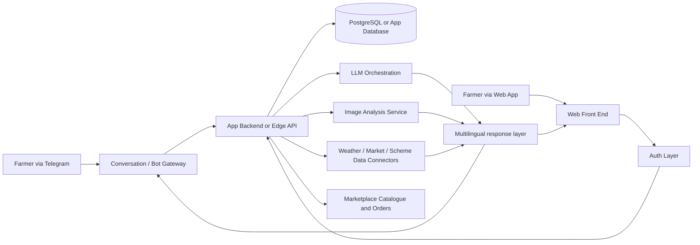
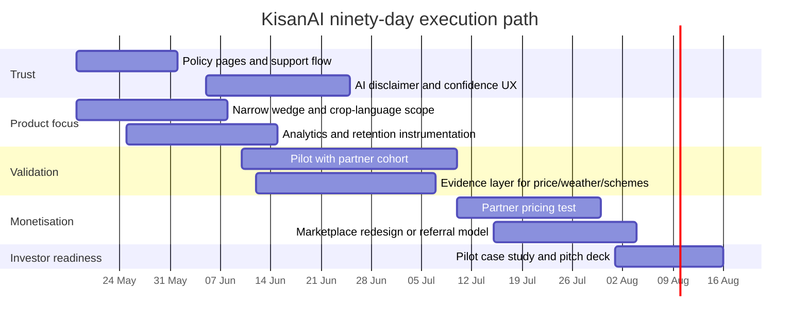

# KisanAI Startup Research Report

## Executive summary

KisanAI presents itself as **“India’s First AI-Powered Agricultural Assistant”** for Indian farmers, with a public value proposition built around **crop disease detection, a multilingual AI chatbot, weather forecasts, mandi prices, government-scheme guidance, and a farmer marketplace**. The indexed public product surface I could verify includes the landing page, sign-in and sign-up flows, an in-app dashboard, advisory and weather modules, a marketplace, a product-detail page, and a profile page. Product Hunt lists the product as **free**, launched in **2025**, and frames it as a Telegram-first assistant built for the **YUKTI AICTE Hackathon 2025**. citeturn24search0turn24search4turn24search5turn24search6turn26search2turn26search10turn26search15turn17view0turn43search1

The product idea is directionally strong because it aligns with real, persistent farmer pain: fragmented sources of truth, weather volatility, poor price discovery, weak market access, and gaps in last-mile advisory in local languages. Public market signals also show that Indian farmers are already willing to use digital agricultural products at scale: Plantix has **10 million+ downloads**, BharatAgri shows **5 million+ downloads**, DeHaat’s farmer app says it serves **1.4 million+ farmers in 12 states**, Krishify claims **1 crore+ farmers**, and Bayer says FarmRise has crossed **5 million users**. That means the category is validated; the challenge for KisanAI is not “is there demand?” but “how can a small product be credibly better, simpler, and more trusted than incumbents?” citeturn51search4turn51search5turn51search7turn51search18turn51news38

My overall assessment is that KisanAI currently looks more like a **promising hackathon-to-MVP product** than a fully investment-ready startup. The biggest strengths are the breadth of problem understanding, the multimodal/AI ambition, and the clear farmer-facing UX modules already visible publicly. The biggest weaknesses are the absence of public trust infrastructure: I did not find a clear public **About**, **Pricing**, or separately accessible **Privacy / Terms / Contact** page during this crawl, even though the footer references those items. That gap is especially important because the product handles identity, crop photos, location-like context, orders, posts, and AI advice. citeturn24search3turn24search4turn24search5turn24search6turn26search8turn43search1turn43search3

The most viable path to startup success is to **narrow the wedge**. Instead of trying to win all farmer jobs at once, KisanAI should become best-in-class at one or two daily, urgent jobs: **disease diagnosis + treatment guidance**, and **market / scheme / weather triage in local language**. Once trust is earned there, commerce, community, and partner distribution can be layered on top. In other words: **own one decision loop before owning the whole farm OS**. This conclusion follows from the site’s current breadth, the proven category scale of specialised rivals, and the operational burden implied by an all-in-one marketplace-plus-advisory product. citeturn24search5turn26search2turn26search10turn17view0turn51search0turn51search2turn51search7turn51news38

## Product audit and founder clarity

### What is publicly visible today

The indexed public footprint suggests that KisanAI is already more than a single landing page. It has a recognisable app structure with the following public surfaces: landing page, authentication, dashboard, services, marketplace, product details, and profile. The dashboard prominently features **PM-Kisan Samman Nidhi** with a “Check Eligibility” action; the advisory page shows crop-stage-specific recommendations for wheat, paddy, and cotton; the weather page shows a seven-day forecast; the marketplace page lists seeds, fertilisers, and tools; the profile page shows user identity, language settings, orders, posts, and versioning. Together, these pages show that the startup is attempting to unify **advisory, data retrieval, marketplace, and user-account workflows** in one surface. citeturn24search4turn24search5turn24search6turn26search2turn26search8turn26search10turn25search0

A concise audit of the discoverable public pages is below.

| Public page | What it shows | Why it matters | Evidence |
|---|---|---|---|
| Landing page `/` | Core promise: AI agricultural assistant for Indian farmers; crop disease detection, multilingual chatbot, weather, mandi prices, Telegram; demo CTA | Clear top-of-funnel positioning | citeturn24search0turn31search1turn38search4 |
| Sign-in `/sign-in` | Google sign-in, passkey, email/password | Modern auth ambitions and lower-friction onboarding | citeturn24search4turn26search12 |
| Sign-up `/handler/sign-up` | Account creation with Google and email/password | Confirms direct consumer onboarding path | citeturn26search15 |
| App home `/application` | PM-Kisan card and eligibility CTA | Government-scheme workflow is a visible use case | citeturn24search6turn25search0turn36search0 |
| Marketplace `/application/marketplace` | Seeds, fertilisers, tools, ratings, prices, “Sell Crop” | Commerce layer already exists publicly | citeturn24search5turn26search6 |
| Product detail `/marketplace/product/4` | Contact email, Telegram handle, YUKTI 2025 footer | Important trust/contact and provenance signals | citeturn31search3turn43search3 |
| Advisory `/application/services/advisory` | Stage-based crop recommendations | Shows agronomy-specific content, not just generic chat | citeturn26search10 |
| Weather `/application/services/weather` | City weather, wind, humidity, rain chance, 7-day forecast | Confirms operational weather module | citeturn26search2 |
| Profile `/application/profile` | Orders, posts, language, privacy/security, help/support, version 1.0.0 | Reveals user-data, trust, and retention surfaces | citeturn24search3turn26search8 |

### Founder clarity document

Public evidence strongly suggests that the product is being built by **Shaswat Raj** or within his maker/studio ecosystem, but the company structure is **not yet publicly legible on the product site itself**. Product Hunt lists **Shaswat Raj** as the maker, and a public portfolio for the same name includes a **Kishan AI** project described as an AI-powered Telegram/web/app assistant for farmers, using **Python, AI/ML, computer vision, Telegram Bot, React, and Next.js**. A public Reddit post for the same domain describes the project as a side project using **Next.js, Cloudflare Workers, PostgreSQL, and a multilingual model pipeline**. The site itself, however, does not expose a clean About page, team page, or entity disclosure during the discoverable crawl. citeturn17view0turn28image0turn41search1turn47search17

That produces a “founder clarity” picture with one confirmed public maker, one likely solo-builder or very-small-team architecture, and one unresolved question around the relationship between **KisanAI** and **Strivio**. The product lives on a `strivio.world` subdomain, and Strivio has other public products in the same domain family; Companies House also shows a **STRIVIO LTD** incorporated in the UK in August 2025, but I cannot prove from the reviewed sources that this entity legally owns or operates KisanAI. This ambiguity matters because early startup trust is strongly affected by visible ownership, support, and accountability. citeturn38search0turn40search5turn41search10

### Solution map

The solution map below shows what KisanAI is trying to solve at a workflow level.

| User job | Current visible solution in KisanAI | Strength | Gap | Evidence |
|---|---|---|---|---|
| Diagnose crop problems | Disease detection is part of the core promise | High urgency, frequent need | No public proof of accuracy, escalation, or confidence score | citeturn24search0turn17view0turn28image0turn12view0 |
| Get crop advice | Advisory page with crop-stage tips | Tangible agronomy workflow | Looks static from indexed surface; personalisation not publicly visible | citeturn26search10 |
| Check weather | Seven-day weather view | Daily utility, retention driver | No visible hyperlocal field-level context from indexed page | citeturn26search2turn17view0 |
| Check mandi prices | Landing-page value prop mentions mandi prices | Strong need tied to selling decisions | No indexed dedicated mandi page found | citeturn24search0turn17view0 |
| Understand schemes | PM-Kisan eligibility card on home | High value if simplified well | Eligibility logic, data sources, and disclaimer not visible publicly | citeturn24search6turn25search0 |
| Buy farm inputs | Marketplace for seeds, fertilisers, tools | Obvious monetisation path | Commerce adds operational complexity very early | citeturn24search5turn26search6 |
| Build farmer identity / history | Profile page with posts, orders, crops, language | Retention potential | Raises privacy and support obligations | citeturn24search3turn26search8 |
| Chat in natural language | Telegram-first, multilingual AI positioning | Good fit for low-friction usage | Trust, hallucination, and traceability questions remain | citeturn17view0turn24search0turn43search1 |

## Problem research and customer definition

### Problem research with evidence and user signals

The startup thesis is credible because the underlying farmer problem is not fabricated; it is highly visible in both public reporting and the product’s own information architecture. Down To Earth summarises the structural challenge well: small and marginal farmers face **erratic rainfall, rising input costs, limited market access, exploitative middlemen, and weak access to affordable credit**, and it explicitly notes that digital marketplaces can help with price discovery while warning that **digital literacy gaps persist**. KisanAI’s own product structure mirrors those pain points almost exactly: disease help, weather, mandi prices, scheme assistance, and marketplace access. citeturn48view0turn24search0turn24search5turn24search6turn26search2turn26search10

Climate and weather risk are also immediate, not theoretical. Reuters reported in early 2025 that above-average temperatures in March threatened India’s wheat and other winter crops after several hot years, and later in 2025 reported that late monsoon downpours damaged soybean and cotton, depressed market prices below support levels, and forced indebted farmers to sell under distress. The Guardian captured the emotional reality in Punjab with the quote **“Everything is gone”** after severe flooding. These are exactly the kinds of fast-moving operational shocks that make lightweight advisory, alerting, and triage tools valuable. citeturn45news42turn49news42turn49search1

There is also a clear language-and-complexity problem. In a public builder note for the same domain, the project rationale says existing tools are **“too complex or not available in local languages.”** That is not just a positioning slogan; it is a practical diagnosis of why adoption in this market is hard. The emphasis on Telegram, regional-language chat, passkeys, and low-friction sign-in all fit that reality. citeturn41search1turn24search0turn24search4turn26search15

The best public user/distribution insight I found is brutally simple: Indian farmers are often **not easiest to reach through startup-native channels**, but through **WhatsApp, YouTube, Instagram, local shops, mandis, FPOs, agri-input dealers, and word of mouth**. That means KisanAI’s biggest risk is not only model quality; it is **distribution mismatch**. An elegant product that depends on Product Hunt-style discovery will underperform in a market that often scales through dealer networks and local trust. citeturn47search5turn17view0

### ICP and personas

KisanAI should not think of “Indian farmers” as one ICP. The more realistic segmentation is this:

| Persona | Core need | Trigger moment | Buying / adoption path | Why KisanAI fits |
|---|---|---|---|---|
| Smallholder crop farmer | Fast diagnosis, weather, price and scheme clarity | Leaf spots, spraying decision, selling day, subsidy confusion | Self-serve Telegram or assisted onboarding via dealer/FPO | Current product already bundles these jobs |
| Progressive farmer / agri-entrepreneur | Better planning, marketplace access, reminders, crop history | Seasonal crop planning and selling optimisation | App/web + recurring use | Marketplace + profile + advisory can compound value |
| FPO / NGO field worker | Standardised answers for many farmers | Repeated scheme, disease and weather queries | B2B2C or organisation-led rollout | Multilingual assistant scales human extension capacity |
| Input dealer / local agri shop | Lead-gen and trust-building with nearby farmers | Farmer asks what to buy or how to treat a disease | Partner dashboard or referral model | Commerce and advisory can be linked |
| Agri enterprise / white-label partner | Farmer support at scale, vernacular channel support | Need to reduce support load and improve conversion | B2B licensing | Most durable monetisation path if product matures |

The near-term ICP should be **smallholders and extension intermediaries in one or two language regions**, not all India at once. The reason is operational: disease diagnosis, scheme logic, weather, and recommended treatments all become more trustworthy when narrowed by crop, region, and language. That is also how competitive products have scaled: they solved narrow farmer jobs well before widening the stack. citeturn51search0turn51search2turn51search7turn51news38turn51search18

### Market size and trend view

India’s agricultural market is large enough that even a tightly scoped advisory startup can become meaningful. Official government material says **89.4% of agricultural households own less than two hectares**, and the Department of Agriculture and Farmers Welfare uses a projected base of **12.50 crore small and marginal farmer landholders** for a major farmer scheme. Meanwhile, India’s 2025 telecom modular survey reported that **85.5% of households had at least one smartphone** and **86.3% had internet access within the household premises**. PIB also reported agriculture and allied GVA at **₹52,08,800 crore** in the Second Advance Estimates for 2025-26. citeturn50search1turn50search19turn50search3turn50search0

That supports the following planning model.

| Layer | Planning view | Logic | Confidence |
|---|---|---|---|
| TAM | ~12.5 crore small and marginal farmer landholders | Official planning base used by the agriculture ministry for SMF-facing schemes | High |
| SAM | ~10–11 crore digitally reachable households as an upper-bound inference | Applying national household smartphone penetration to the SMF base; this is an inference, not a measured farmer-only count | Medium |
| Practical early SAM | ~1–2 crore farmers in one language cluster plus partner-led channels | Narrowing to the regions, crops, and channels a tiny startup can actually support | Medium |
| Early SOM | 50,000–250,000 active farmers or assisted beneficiaries in 24–36 months | Ambitious but plausible if one wedge works and partner channels are used | Low to medium |

The category trend is also favourable. India’s internet user base crossed **950 million** in 2025 according to IAMAI reporting, while incumbent agri apps are demonstrating large-scale farmer adoption: Plantix at **10M+ downloads**, BharatAgri at **5M+ downloads**, Krishify at **1 crore+ farmers**, DeHaat at **1.4M+ farmers**, and Bayer’s FarmRise at **5M users**. This means the market is not waiting for “digital agriculture to start”; it has already started. KisanAI’s problem is differentiation and trust, not category education. citeturn50search11turn51search4turn51search5turn51search7turn51news38turn51search18

## Competitive position and business model

### Competitor matrix

Below is a practical competitor matrix focused on farmer-facing products that overlap with KisanAI’s current promise.

| Product | Core wedge | What overlaps with KisanAI | Stronger than KisanAI today in public proof | Weaker than KisanAI today in public proof | Evidence |
|---|---|---|---|---|---|
| Plantix | Crop diagnosis and treatment | Disease detection, advisory | Strong scale proof and crop-damage depth; 10M+ downloads, 30 crops, 780+ damages | Less visibly broad on schemes / marketplace in the public app store surface | citeturn51search0turn46search24 |
| BharatAgri | Crop advice + agri shopping | Weather, crop advice, smart farming, e-commerce | Bigger public adoption and stronger shopping footprint | Less clearly positioned as AI assistant / bot-first experience | citeturn51search1turn51search5turn51search9 |
| AgriApp | Advisory + services marketplace | Crop advisory, soil, farm services | Broader service catalogue including soil testing and drone services | Less bot-like conversational differentiation | citeturn51search2turn51search10 |
| DeHaat Farmer App | Full-stack farmer operating app | Advice, mandi, weather, consultations, inputs, market linkages | Much stronger partner/economy integration and visible farmer scale | KisanAI may offer a simpler, more modern AI-native UX if executed well | citeturn51search3turn51search7turn51search11 |
| FarmRise | Bayer’s direct-to-farmer platform | Advisory, crop insurance, credit, market connectivity | Massive brand distribution and 5M-user proof | Likely less nimble and less indie-product-like iteration speed | citeturn51news38 |
| Krishify | Information + community + expert connect | Community, advisories, expert access | Strong farmer network and content/community engine | KisanAI appears more AI-assistant centric and decision-tool oriented | citeturn51search18 |
| KissanAI | Enterprise/voice-first agricultural AI | Multilingual agriculture AI, domain-specific models | Enterprise depth, clearer company footprint, larger organisation | Less obviously consumer-MVP lightweight than KisanAI | citeturn18search1turn20search6 |

The clearest conclusion from the matrix is this: **KisanAI should not try to beat incumbents feature-for-feature**. Plantix already owns diagnosis credibility at scale; DeHaat already owns deep service integration; FarmRise and KissanAI have stronger institutional backing; BharatAgri and Krishify have stronger adoption and content/community proof. KisanAI’s best chance is a **faster, cleaner, locally trusted, assistant-first wedge** that feels easier than the incumbents and is distributed through human networks rather than app-store discovery alone. citeturn51search0turn51search5turn51search7turn51news38turn18search1

### Business model and pricing critique

Publicly, the product is positioned as **free** on Product Hunt, and I did not find a separate public pricing page in the discoverable crawl. That is fine for launch, but it is not enough for startup durability because the visible feature set is expensive to operate relative to a typical hobby project: multimodal AI, weather, marketplace, identity, and support all imply recurring operational costs and trust obligations. citeturn17view0turn24search5turn24search6turn26search2turn24search3

The most credible monetisation ladders, in order, are:

1. **B2B2C / partner distribution** for FPOs, input dealers, NGOs, or agri brands.  
2. **Lead-gen / transaction commissions** on marketplace purchases or referrals.  
3. **Premium expert escalation**, not premium access to basic advice.  
4. **White-label assistant licensing** for agribusinesses or regional organisations.  
5. **Sponsored scheme or application enablement**, only if trust and neutrality are preserved.

The least attractive early model is pure consumer subscription. Indian farmers will pay for value, but they usually do so when value is **directly monetisable or risk-reducing**. A subscription for generic chat is fragile; a model tied to reducing losses, improving selling timing, or converting input intent is much more defensible. This pattern is also consistent with how category leaders have blended advisory with commerce, services, or partner ecosystems. citeturn51search3turn51search7turn51news38turn51search5

### Illustrative unit economics

The table below is an **analytical planning model**, not an observed company metric set.

| Scenario | Revenue logic | Indicative monthly revenue per active farmer | Indicative monthly COGS per active farmer | Gross margin view | Notes |
|---|---:|---:|---:|---|
| Free consumer only | No monetisation | ₹0 | ₹3–₹10 | Negative | Useful for acquisition, not a business |
| Affiliate / lead-gen | Input referrals or commerce commission | ₹5–₹20 | ₹3–₹10 | Thin to moderate | Needs strong partner network |
| Premium expert escalation | Free AI + paid human agronomist / concierge | ₹20–₹60 | ₹5–₹20 | Moderate | Best where trust is high |
| B2B2C partner licence | NGO/FPO/enterprise pays per supported farmer | ₹15–₹40 equivalent | ₹3–₹12 | Good | Best fit for early startup stability |
| White-label enterprise | Fixed SaaS + implementation | Much higher per account | Team-heavy | Strong if sales happen | Better after proof of accuracy and workflows |

The practical implication is straightforward: **KisanAI should optimise for trust and distribution before optimising for consumer monetisation**. The moment a partner can say “this tool reduced support load, improved query resolution, or increased higher-intent buying”, the business becomes much easier to sustain.

## MVP, techstack and delivery risks

### Recommended MVP scope

The current public surface is already wider than a first startup MVP should be. A sharper MVP would keep only the pieces that compound trust and usage frequency.

**Keep in the MVP**
- Multilingual assistant
- Crop disease diagnosis from image
- Weather plus farm-action prompts
- One scheme / eligibility explainer flow
- Basic user profile and conversation history

**Defer or narrow**
- Full marketplace breadth
- Community/feed
- Broad seller network
- Too many crops or too many languages at once
- Generic “ask anything” assistant behaviour without domain guardrails

The reason is simple: the best early startup products feel **narrow but reliable**. Right now, public KisanAI feels **rich but potentially diffuse**. A wedge around “what’s wrong with my crop, what should I do today, and what price/benefit matters right now?” is much more memorable than a half-built everything-app. citeturn24search5turn24search6turn26search2turn26search10turn17view0

### Techstack analysis

I could not do a packet-level or header-level inspection in a reliable way from the public crawl, so the stack analysis below is **inferred from public builder artefacts and visible UX**. The highest-confidence inference is that the current product is likely built with a **React / Next.js style web front end**, using **AI/ML and computer-vision components in Python**, with **Telegram** as a major channel. The strongest public evidence is the maker portfolio entry describing the project as a Telegram/web/app assistant using **Python, AI/ML, Computer Vision, Telegram Bot, React, and Next.js**, alongside a public Reddit build note mentioning **Next.js, Cloudflare Workers, PostgreSQL, and a multilingual model pipeline**. An older public GitHub repository under the same project name shows a **Flask-based WhatsApp bot** with Gemini, speech, translation, a knowledge base, and image analysis, suggesting the product may have evolved from a WhatsApp-centric prototype into a broader Telegram/web experience. citeturn28image0turn41search1turn47search17turn12view0

The visible auth surface supports **Google sign-in, passkeys, and email/password**, which implies modern authentication tooling and a desire to reduce sign-up friction. The profile surface shows versioning (**1.0.0**) and a user model with crops, orders, and posts, implying structured persistence rather than a stateless demo. citeturn24search4turn26search12turn26search15turn24search3turn26search8

This is the delivery architecture I would recommend for the product at its current stage. It keeps the conversation layer thin, pushes state into a real database, isolates image analysis from the main request path, and makes external data connectors replaceable. That matters because early agri-assistant products often change model vendors, data vendors, or channel strategies before finding a stable operating model. citeturn28image0turn41search1turn12view0

### AI and data pipeline view

The AI/data pipeline should be treated as a **decision-support system**, not a generic chatbot. The old GitHub implementation already points in the right direction: domain prompts, knowledge-base search, response validation, translation, speech-to-text, and image analysis. For the current product, the right pipeline is:

1. normalise user input in local language, text, voice, or image,  
2. classify the intent,  
3. route to the correct subsystem,  
4. attach region/crop/stage context,  
5. return an answer with source class and confidence,  
6. log outcomes for review and model improvement. citeturn12view0turn28image0turn41search1

The critical design principle is that **disease diagnosis, scheme eligibility, and market advice should not all be handled by one undifferentiated LLM call**. Each has a different risk profile. A failed chat answer is annoying; a failed disease recommendation can cost yield; a failed scheme answer can create mistrust; a failed price answer can harm selling decisions. The pipeline therefore needs routing, confidence thresholds, and escalation logic.

### Security, privacy and trust risks

The most immediate product risk is not model performance; it is **trust debt**. The public product visibly handles user identity, language, orders, posts, crops, and likely image uploads, yet the discoverable public surface did not expose clearly accessible standalone **privacy**, **terms**, or **help/contact** pages beyond footer references. That is a serious gap for any startup, and doubly serious for one offering AI-generated advisory that can influence spraying, buying, or income decisions. citeturn24search3turn26search8turn43search1turn43search3

The main operational risks are these:

| Risk | Why it matters | Current signal | Priority |
|---|---|---|---|
| Hallucinated agronomy advice | Can cause crop loss or unsafe recommendations | Assistant-first positioning is strong; public safety controls are not visible | Critical |
| Missing or hard-to-find privacy / terms | Weakens trust and raises data-handling concerns | Footer references exist but pages were not clearly discoverable | Critical |
| Image and location consent | Crop photos and regional context can become sensitive personal/farm data | Product promise and profile make this likely | High |
| Scheme-eligibility overclaiming | Farmers may rely on the tool for benefits they do not actually qualify for | Home screen promotes eligibility checks | High |
| Marketplace trust | Wrong products, poor fulfilment, or unclear refund terms damage trust fast | Marketplace already visible publicly | High |
| Weak support escalation | Farmers need help when the model is unsure | Email / bot handle visible, but no robust support workflow surfaced | Medium to high |

The minimum trust stack before serious scaling should include: visible policy pages; explicit agricultural-advice disclaimers; confidence labels for diagnosis; escalation to human expert or support when confidence is low; and auditable source classes for scheme / market answers.

## Go-to-market, compliance and investor narrative

### GTM and launch plan

KisanAI should launch as a **channel strategy**, not only as an app. Public discussion around reaching Indian farmers points toward **WhatsApp/Telegram, YouTube, local shops, mandis, FPOs, agri dealers, and word of mouth**, and competitor scale proves that farmer digital products can become large when distribution is practical rather than startup-theatrical. citeturn47search5turn51news38turn51search18turn51search7

The best GTM plan is:

- **Channel one: Telegram / messaging loop.**  
  Use low-friction farmer questions, image diagnosis, and seasonal prompts.

- **Channel two: local partner distribution.**  
  Recruit FPOs, dealers, agri-input shops, and field workers as onboarding partners.

- **Channel three: YouTube and short vernacular explainers.**  
  Show disease diagnosis, weather-action prompts, mandi interpretation, and scheme explainers in live examples.

- **Channel four: pilot cohorts.**  
  Choose one crop cluster and one language region first. Cotton, wheat, paddy, or horticulture clusters can work if the diagnosis set is narrow and the partner network is real.

- **Channel five: proof-driven B2B2C sales.**  
  Sell to organisations once one pilot can show faster query resolution, lower support burden, or higher farmer engagement.

A simple launch narrative would be: **“Ask in your language. Send a crop photo. Get today’s farming next step.”** That is much stronger than a generic “AI for agriculture” message.

### Legal and compliance checklist

This is not legal advice, but it is the operational checklist KisanAI should satisfy before claiming startup readiness.

| Item | Public status in this audit | Why it matters | Priority |
|---|---|---|---|
| Privacy policy | Not clearly discoverable as a standalone public page | Personal data, crop images, account data, orders | Critical |
| Terms of service | Not clearly discoverable as a standalone public page | Use rights, disclaimers, liability boundaries | Critical |
| Contact / grievance channel | Email and bot handle visible; no robust support page found | Trust, complaints, user recovery | High |
| Marketplace terms / refunds | Not discoverably clear | Commerce disputes and consumer confidence | High |
| AI-agronomy disclaimer | Not visible on site surface I reviewed | Advice can affect yield and expenses | High |
| Data retention and deletion | Not visible | Users need to know what happens to crops, images, orders, and chats | High |
| Consent for image / location processing | Not visible | Sensitive operational and personal data | High |
| Partner / seller disclosure | Not visible | Prevents opaque recommendations and commercial bias | Medium to high |
| Accuracy / source-policy note | Not visible | Crucial for schemes, prices, and treatment guidance | Medium to high |

The site footer itself makes the missing-doc gap unusually obvious, because it references **Privacy**, **Terms**, and **Contact** in public snippets. The problem is not that the startup forgot legal scaffolding entirely; the problem is that the scaffolding is either missing, inaccessible, or not easily discoverable. citeturn43search1turn43search3

### Pitch deck outline

A strong fundraising or incubator pitch deck for KisanAI should look like this:

| Slide | Message |
|---|---|
| Title | KisanAI: multilingual crop and decision assistant for Indian farmers |
| Problem | Farmers still assemble decisions from fragmented, inconsistent sources |
| Why now | Smartphone and internet access are high; digital ag adoption is already real |
| Product | Disease diagnosis, advisories, weather, price and scheme workflows in one assistant |
| Demo | One real farmer journey from crop photo to next action |
| Market | 12.5 crore SMF base; digital access and category adoption are large |
| Competition | Incumbents prove demand, but leave room for a cleaner assistant-first workflow |
| Wedge | Own the “today’s next action” loop before expanding to full farm OS |
| Business model | Partner-first B2B2C, commerce/referral, human expert escalation |
| GTM | Telegram + local partners + vernacular video + crop-cluster pilots |
| Trust and moat | Region-language-crop data, workflow design, partner distribution, usage data |
| Roadmap and ask | Pilot, validate, narrow, and scale with explicit milestones |

If the audience is an incubator or fellowship rather than a VC, the deck should emphasise **problem depth, farmer accessibility, and trust design** over aggressive top-line projections.

### Prioritised action roadmap

| Time window | Priority action | Outcome expected | Why this comes first |
|---|---|---|---|
| First 30 days | Publish clear Privacy, Terms, Contact, AI disclaimer, and support flow | Trust baseline established | Without this, growth increases risk |
| First 30 days | Cut scope to one crop cluster + one language + one wedge | Higher product clarity | Focus beats breadth |
| First 30 days | Instrument analytics across sign-up, first question, image upload, repeat use | Real retention data | You need truth before scale |
| Days 30–60 | Run a pilot with one FPO, dealer network, or field team | Qualitative and quantitative proof | Better than broad public launch noise |
| Days 30–60 | Add confidence labels and escalation for diagnosis and schemes | Safer, more credible UX | Trust differentiator |
| Days 30–60 | Build a compact evidence layer for weather, prices, and schemes | Source-aware answers | Helps both users and partners |
| Days 60–90 | Test a partner monetisation model | First revenue signal | More realistic than consumer subscription |
| Days 60–90 | Rebuild marketplace as a narrow lead-gen/referral layer if pilot shows intent | Lower ops burden, clearer monetisation | Avoids early commerce sprawl |
| Days 60–90 | Prepare a proof-first founder deck and pilot case study | Fundraising / grant readiness | Narrative becomes credible after usage proof |

## Research links and limitations

### Core primary sources used

- KisanAI landing page and indexed app pages. citeturn24search0turn24search4turn24search5turn24search6turn26search2turn26search10turn26search15turn24search3
- Product Hunt listing for KisanAI. citeturn17view0
- Public GitHub repository `mandarwagh9/KisanAI`. citeturn12view0
- Maker portfolio entry for Kishan AI on Shaswat Raj’s site. citeturn28image0turn29view0
- Public Reddit build note for the live KisanAI domain. citeturn41search1turn47search17

### Market and adoption sources used

- Government statistics on small/marginal farmers and digital access. citeturn50search1turn50search19turn50search3turn50search0
- Reuters and Guardian reporting on climate and market stresses affecting farmers. citeturn45news42turn49news42turn49search1
- Down To Earth analysis of smallholder constraints, market access, credit, and digital literacy gaps. citeturn48view0
- IAMAI/NDTV reporting on India’s internet user growth. citeturn50search11

### Competitor and category sources used

- Plantix official site and Google Play listing. citeturn51search0turn51search4
- BharatAgri public Play listings and public description. citeturn51search1turn51search5turn51search9
- AgriApp public listing and about pages. citeturn51search2turn51search10
- DeHaat official and app pages. citeturn51search3turn51search7turn51search11
- Bayer FarmRise user-scale news. citeturn51news38
- Krishify public farmer-app page. citeturn51search18
- KissanAI company/about and LinkedIn profile. citeturn18search1turn20search6

### Open questions and limitations

This report is rigorous but not omniscient. Some public pages on `kishanai.strivio.world` appear to be highly dynamic, which limited direct line-by-line extraction and prevented a full **network / header / JavaScript bundle** inspection from the indexed crawl. As a result, the **techstack analysis is inferential**, not packet-confirmed. I also could not verify public revenue, retention, DAU/MAU, accuracy metrics, or a definitive legal relationship between KisanAI and any Strivio entity from the reviewed sources alone. Finally, while the footer references Privacy, Terms, and Contact, I could not confirm standalone discoverable pages for those items during this audit, so that finding should be read as **“not discoverable in the reviewed public crawl”**, not as a definitive statement that no such page exists anywhere.