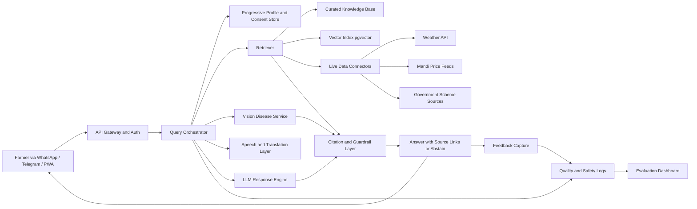
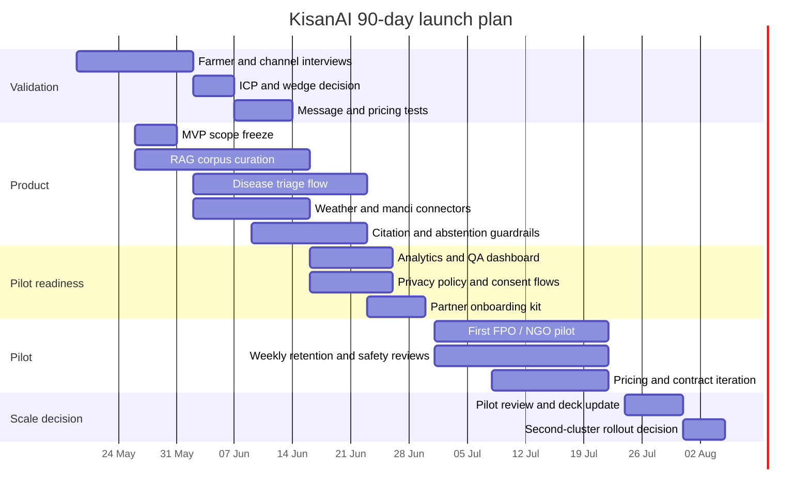

# KisanAI Startup Research Report

## Executive summary

KisanAI appears to be an early-stage, mobile-first agricultural assistant aimed at Indian farmers. The highest-confidence public evidence comes from the product’s site title and an external founder post, which together position it as “India’s First AI-Powered Agricultural Assistant” and describe a feature set that includes regional-language question answering, crop-disease detection from images, real-time mandi prices, hyper-local weather, and simplified government-scheme guidance. The same post says the project was built because existing tools are “too complex” or not available in local languages, and that the current stack includes Next.js, Cloudflare Workers, PostgreSQL, and a multilingual model pipeline. citeturn6view0turn10view0

The opportunity is real, but the business is not yet investable as-is. Public materials do **not** establish founder identity, team depth, customer traction, retention, pricing, data moat, regulatory posture, or a clear revenue model. That means the biggest near-term priority is not adding more features; it is turning a promising demo into a narrow, evidence-backed wedge with measurable retention among a tightly defined farmer segment. citeturn6view0turn10view0

The strongest strategic read is this: KisanAI should not try to be “all agriculture for all India” in the next 90 days. The right wedge is a **vernacular, low-friction, messaging-first advisory assistant** for one crop cluster and a handful of recurring jobs to be done: disease triage, local weather interpretation, mandi-price context, and scheme eligibility explained in simple language. That wedge aligns with publicly observed user pain around confusing agricultural apps, repeated trips caused by technical glitches, information access barriers, and the need for language-friendly, low-latency advisory systems. citeturn50news0turn51news1turn50academia2turn50academia3turn51academia10

Market conditions are supportive. India’s rural internet user base is already large, vernacular usage is high and expected to deepen, 5G coverage has expanded rapidly, and both public and private actors are increasing investment in digital agriculture assistance. The ministry-backed Bharat-VISTAAR launch, Bayer FarmRise crossing 5 million users, DeHaat’s scale, and Cropin’s field-level value evidence all suggest that the space is active and that farmers and channel partners will adopt digital tools if they are trusted, relevant, and operationally simple. citeturn42search8turn42search7turn50news8turn45news0turn47news1turn47news4

My overall conclusion is that KisanAI has a credible **problem thesis** and a sensible **product direction**, but it still lacks the core proof required for startup success: founder-market fit evidence, repeatable acquisition, trust signals, and economic clarity. The most actionable next move is to run a 90-day pilot around one ICP, measure retention weekly, and sell through FPOs, agri-input partners, or NGOs before attempting broad direct-to-farmer monetisation. citeturn10view0turn50academia3turn50academia2

## Crawl findings and product snapshot

### What was publicly discoverable

The public site is a JavaScript-heavy web app. The root page resolved with the title “KisanAI - India’s First AI-Powered Agricultural Assistant,” but the accessible browser did not expose rendered body text from the page. An indexed `/application` route was also discoverable, but again without retrievable rendered content. A public YouTube handle was surfaced, and a Reddit post linked to the site with a fuller feature description. citeturn6view0turn32view0turn17view0turn10view0

Because the rendered DOM was not text-accessible, this report relies on a hierarchy of sources: first, the site’s accessible metadata; second, the founder’s own public Reddit post; third, public mentions and linked ecosystem evidence; and fourth, external market and technical sources. Where specific information could not be validated from the site, it is marked **unspecified** rather than guessed. citeturn6view0turn10view0

### Product facts with the highest confidence

The product is positioned around a single farmer-facing assistant rather than a narrow point tool. The founder’s public description lists five live or intended capabilities: simple regional-language answers to farming questions, crop-disease detection from images, real-time mandi prices, hyper-local weather forecasts, and simplified explanations of government schemes. The same source says the project is “mainly a learning and exploration project” and names the current stack as Next.js, Cloudflare Workers, PostgreSQL, and a multilingual model pipeline. citeturn10view0

That product framing matters strategically. It means KisanAI is not just another plant-disease model or market-price scraper. It is trying to unify multiple farmer information jobs into one interface. That is directionally attractive because public research on agricultural advisory systems repeatedly shows farmers benefit when weather, markets, plant protection, and local-language access are combined rather than split across disconnected products. citeturn10view0turn50academia2turn50academia3turn50academia14

### Founder clarity assessment

The table below separates what is explicit from what must still be clarified.

| Dimension | Current assessment | Evidence / gap |
|---|---|---|
| One-line vision | **Mostly clear**: AI agricultural assistant for Indian farmers | The product title and founder post support this. citeturn6view0turn10view0 |
| Target customer | **Partly clear**: Indian farmers, especially users needing local-language simplicity | Inferred from product scope and founder statement on local languages and complexity. citeturn10view0 |
| Problem | **Clear**: fragmented, complex, non-vernacular digital support for day-to-day farm decisions | Founder statement plus external evidence on advisory-access problems. citeturn10view0turn50academia2turn51academia10 |
| Why now | **Strong externally, weakly stated on-site** | Rural internet growth, 5G rollout, multilingual AI tooling, and Bharat-VISTAAR support timing. citeturn42search7turn42search8turn50news8 |
| Unfair advantage | **Unspecified** | No public evidence of proprietary data, distribution lock-in, or team moat. citeturn6view0turn10view0 |
| Wedge | **Implicit but too broad** | Product spans disease, prices, weather, schemes. Wedge needs narrowing. citeturn10view0 |
| Exclusions | **Unspecified** | No clear statement of what KisanAI will not do. citeturn6view0turn10view0 |

### Recommended founder statement

A sharper founder narrative would be:

> **KisanAI helps small and lower-digital-literacy Indian farmers make better daily crop decisions in their own language through one trusted assistant for disease triage, price context, weather interpretation, and scheme guidance.**

That version is better because it states the user, the job, the trust mechanism, and the initial scope. It also suggests clear exclusions: not a full ERP, not a broad marketplace-first company, and not a regulated financial or insurance advisor on day one. This is an inference based on the current product evidence and market reality, not a statement already published by the company. citeturn10view0turn50academia3turn50academia2

## Founder clarity, customer, and problem

### Problem research

The market pain is real and urgent. Public evidence shows farmers repeatedly lose money because information is late, fragmented, hard to trust, or difficult to use digitally. An onion farmer in Karnataka described borrowing privately, losing crops to disease after rains, and ending up “in debt”; another said he had “no other option but to sell my land” to repay the loan. In Andhra Pradesh, farmers affected by procurement-system glitches were reported making repeated trips and being pushed toward private traders offering much lower prices. Academic work on Indian agricultural QA systems similarly argues that farmers often lack timely, language-friendly advice and that call-centre-based systems suffer from inconsistency and delay. citeturn50news6turn50news0turn50academia2turn51academia10

The most relevant extracted pain quotes are below.

| Pain theme | Extracted quote | Why it matters for KisanAI | Source |
|---|---|---|---|
| Complex digital flows | “Can't understand which document is needed for registration” | Farmers abandon or mistrust complex workflows | citeturn51news1 |
| Broken feature path | “The agriculture produce marketing committee (APMC) section is blank” | Partial functionality destroys trust quickly | citeturn51news1 |
| Poor data-entry UX | “I tried to add land details but couldn't. Worst experience ever” | Land/crop onboarding must be optional-light on day one | citeturn51news1 |
| Repeated failed access | “They're forced to make repeated trips to village secretariats” | Digital systems that fail operationally impose real travel costs | citeturn50news0 |
| Financial distress after crop shock | “Now, I am facing a big loss and I'm in debt” | Timely disease/weather/market interpretation has obvious ROI | citeturn50news6 |
| Asset-loss desperation | “I have no other option but to sell my land to repay the loan” | Trust must come from actionable help in high-stakes moments | citeturn50news6 |

These quotes point to six design requirements: one-screen onboarding, regional language by default, voice and image input, explicit uncertainty handling, lightweight case history rather than forced profile completion, and a bias toward decision support during “trigger moments” like disease appearance, weather change, mandi visit, scheme deadline, or MSP registration. citeturn51news1turn50news0turn50news6turn50academia3

### Existing workarounds

Farmers do not wait for perfect software. They already stitch together advice from local dealers, WhatsApp groups, KVKs, radio, neighbours, mandi agents, government portals, manual expert networks, and marketplace apps. Government systems like eNAM help with price discovery and online trade, but adoption is still often mediated through agents and intra-market transactions. Longstanding knowledge networks such as aAQUA show that multilingual farmer Q&A has existed for years, but expert-response models are harder to scale with low latency. citeturn54search1turn51search2

That is strategically important: KisanAI is not entering a blank market. It is entering a market full of imperfect substitutes. Its job is not to invent farmer advice; it is to become the **lowest-friction, highest-trust wrapper** around already existing information channels. citeturn54search1turn51search2turn50academia3

### Urgency and willingness to pay

Urgency is high because the economic consequences are large and immediate. Public reports show onion growers spending around ₹80,000 per acre while receiving prices as low as ₹300–₹1,200 for damaged or distressed produce, and cotton farmers being pushed below MSP because digital procurement workflows fail operationally. Where information affects sale timing, disease treatment choice, or weather action, the avoided downside can be far larger than any plausible software fee. citeturn50news6turn50news0turn50news4

Direct end-user willingness to pay is still **unproven** for KisanAI specifically. However, the broader market does demonstrate monetisable value in digital agricultural support. Plantix monetises through input-linked commerce; DeHaat monetises across end-to-end agri services at material scale; Bayer’s FarmRise has reached millions of users; and Cropin generates enterprise value through advisory and analytics tied to measurable farm outcomes. The implication is that willingness to pay likely exists first through **B2B2C and embedded models**, with B2C subscription working only after trust and habit are established. citeturn52search0turn47search1turn45news0turn47news4

### Inferred ICP and customer research plan

The best inferred ICP is **small and lower-middle landholding farmers in one crop cluster, using a smartphone in a vernacular language, facing recurring information asymmetry rather than capital-intensive mechanisation problems**. Public agriculture research emphasises that Indian AI-agri systems disproportionately matter for smallholders, who make up most farmers and lack the capacity to compensate for poor data infrastructure or complicated workflows. citeturn45academia12turn44academia8

The ICP I would test first is:

| ICP hypothesis | Why it fits |
|---|---|
| Crop | Cotton, onion, tomato, chilli, paddy, or soybean cluster with visible disease risk and price volatility | Disease + weather + mandi value are all high |
| Geography | One state to start, then one agro-climatic belt inside it | Localisation matters more than national reach |
| User type | Farmer or farmer-family decision helper aged roughly 20–45 with smartphone access | Highest probability of repeat digital use |
| Language | One dominant regional language plus Hindi fallback | Trust and activation improve when language burden drops |
| Channel | WhatsApp/Telegram/PWA, not app-store-only | Reduces acquisition and install friction |
| Buyer | Initially FPO, NGO, input retailer, or field partner; later farmer directly | B2B2C de-risks CAC |

A practical research sprint should include 25–30 semi-structured farmer interviews, 10 dealer or agri-retailer interviews, 5 FPO managers, and 5 KVK or extension experts. The questions should focus on the last 30 days: what problem occurred, who they asked, what they spent, what they mistrusted, and what action they finally took. The goal is to identify the top three recurring workflows that drive repeat use, not to collect generic “feature ideas.” This recommendation is based on the product’s current breadth and the evidence that advisory systems work best when they are tied to concrete, repeated jobs rather than general chatbot novelty. citeturn10view0turn50academia3turn50academia2

## Market and competition

### Market research

A conservative, startup-usable market model can be built from currently observable digital-farmer proxies rather than broad “all agriculture” narratives. PM-KISAN’s twentieth instalment reached about **9.7 crore farmers**, which is a workable proxy for identifiable Indian farm beneficiaries already inside a digital public-disbursement system. Rural India had about **375.66 million internet subscribers** with about **41.72% rural penetration** as of late 2023, and India’s 5G expansion had reached over **99% of districts** by early 2025 according to references cited in telecom summaries. Separately, WEF-cited vernacular usage indicators suggest language-localised internet consumption is already a major behaviour pattern and likely to grow further. citeturn42news0turn42news1turn42search8turn42search7

That supports the following working estimate.

| Layer | Working assumption | Calculation | Annual value at ₹600 per farmer/year |
|---|---|---:|---:|
| TAM | 9.7 crore digitally traceable farmers | 97,000,000 | ₹58.2 billion |
| SAM | 45% of TAM reachable for smartphone-assisted vernacular advisory in near term | 43,650,000 | ₹26.19 billion |
| SOM | 0.5% of SAM captured as active paying or contract-covered users by Year 3 | 218,250 | ₹130.95 million |

These are **assumption-driven planning figures**, not audited market sizes. They are intentionally conservative and suitable for early fundraising or internal planning because they begin with a public farmer-beneficiary base rather than inflated “India agriculture GDP” abstractions. The ₹600/year benchmark is also modest relative to the economic downside visible in disease, weather, and price shocks. citeturn42news0turn42search8turn50news6turn50news0

### Trend evidence and activity in the space

The trend line is favourable. In early 2026, India’s agriculture ministry launched **Bharat-VISTAAR**, a multilingual AI advisory tool intended to provide customised digital advisories. Bayer said its **FarmRise** app crossed **5 million users** in India. DeHaat reported FY25 revenue of roughly **₹3,000 crore**. Reuters reported case-level evidence from Cropin deployments where a farmer’s net profit improved meaningfully through space-data-driven advice. Meanwhile, KissanAI, a separate startup from KisanAI, is building agriculture-specific multilingual AI with public institutional collaboration and India-language positioning. citeturn50news8turn45news0turn47news1turn47news4turn15search2

The implication is not that the market is crowded beyond entry. It is that **distribution and trust** matter more than raw model capability. Strong competitors already exist at the enterprise, government, and broad-advisory layers. KisanAI’s opportunity is to own a sharper behaviour loop than these players, not to out-feature them on every axis. citeturn45news0turn47news1turn47news4turn50news8

### Competitor and substitute matrix

The most honest matrix for KisanAI is a mix of direct competitors and adjacent substitutes, because a farmer deciding “what do I use?” does not care whether the alternative is a startup, a government tool, or a legacy knowledge network.

| Product | Type | Strengths | Weaknesses | Public complaint / risk signal |
|---|---|---|---|---|
| Plantix | Crop diagnosis + advisory | Strong disease-identification reputation; academic review found it strongest among evaluated disease apps | Business model tied to agrochemical commerce can create trust tension | Wired reported shift toward pesticide-selling and mission drift concerns; academic work says most apps still need functional improvement. citeturn35view0turn38news1 |
| Cropin | Enterprise agri intelligence | Proven enterprise value; satellite/data-driven planning linked to improved outcomes | Primarily enterprise-focused, not a lightweight farmer assistant | Reuters notes sector still faces literacy and land-fragmentation barriers. citeturn47news4 |
| DeHaat | End-to-end agritech platform | Large scale, multiple monetisation lines, established distribution | Broad operating model; not obviously the simplest assistant-first UX | Public complaint data was limited in the material reviewed; risk is operational complexity rather than chatbot elegance. citeturn47search5turn47news1 |
| Bayer FarmRise | Large-scale digital farmer platform | 5 million users; backed by a large agribusiness distribution network | Corporate ecosystem may not feel neutral for advisory | No clear public complaint set found in reviewed sources; strategic risk is perceived bias toward ecosystem-led monetisation. citeturn45news0 |
| KissanAI | Separate multilingual agri-AI startup | Strong India-language positioning; public partnership credibility | Different company; likely heavier platform ambitions | Competitive risk is mindshare and institutional partnerships rather than direct UX comparison today. citeturn15search2 |
| Bharat-VISTAAR | Government AI advisory | Massive distribution potential; official legitimacy; multilingual advisory | Government rollout speed and user-experience quality remain uncertain | No public user-complaint set found yet; competitive risk is state-backed reach. citeturn50news8 |
| eNAM | Government market platform | Strong price-discovery and online mandi infrastructure | Mostly trading-oriented; not a conversational decision assistant | Public sources note heavy intra-market usage and agent mediation rather than fully independent farmer-led use. citeturn54search1 |
| aAQUA | Multilingual farmer Q&A network | Longstanding multilingual agricultural knowledge exchange | Expert-response model is harder to scale at low latency | Main risk is slower response and older community/forum interaction patterns. citeturn51search2 |
| Krishi Sathi / KisanQRS | AI advisory systems | Strong technical results around multilingual and retrieval-based advisory | Research/pilot orientation rather than visible scaled go-to-market distribution | Technical quality does not automatically solve distribution and trust. citeturn50academia2turn51academia10 |

### Positioning recommendation

KisanAI should position itself as the **most operationally simple vernacular decision assistant**, not as the most advanced agronomy platform. That means three emphasis points: simple answers in local language, clear source-backed decision guidance, and fast multimodal input through voice + image + chat. By contrast, it should explicitly avoid competing head-on with DeHaat’s full-stack services, Cropin’s enterprise analytics, or Bharat-VISTAAR’s public-policy breadth in the short term. citeturn10view0turn47news1turn47news4turn50news8

## Product strategy, MVP, and technical architecture

### Solution mapping

The MVP should map tightly to recurring problems and measurable outcomes.

| Problem | Current bad solution | KisanAI feature | Success metric |
|---|---|---|---|
| Farmer cannot interpret disease symptoms quickly | Ask a dealer, guess, spray broad-spectrum chemical, wait | Image-based disease triage with confidence + next-step checklist | Time-to-first-action, image-diagnosis completion rate, repeat diagnostic use |
| Farmer hears weather but not what to do next | Generic forecast app with no crop context | Weather-to-action translation in local language | Alert open rate, advisory follow-through, user-reported usefulness |
| Farmer sees mandi price but not decision context | Raw prices without timing or location nuance | Localised mandi-price summaries and trend explanation | Price-check frequency, retention around market days |
| Government scheme information is dense or bureaucratic | PDF, agent, office visit, or confusion | Plain-language scheme explainer with eligibility checklist | Scheme-answer satisfaction, reduction in escalations |
| App onboarding is too complex | Long forms, land records, many fields | No-mandatory-profile mode with progressive profiling | Activation rate, day-7 retention, onboarding completion |

This table is derived from the product’s own feature framing and the public pain evidence around app complexity, information fragmentation, and urgency in disease, weather, and price decisions. citeturn10view0turn51news1turn50news0turn50news6

### MVP scope

The right MVP is smaller than the current narrative suggests. I would recommend:

| Include now | Defer |
|---|---|
| Text chat in one primary regional language + Hindi fallback | Full pan-India language surface |
| Image symptom triage for 1–2 crops | Broad disease coverage across many crops |
| Weather interpretation with “what should I do today/tomorrow?” | Deep agronomic planning and season-long scheduling |
| Mandi-price summaries for selected districts | National live marketplace breadth |
| Scheme explainer with source links and abstention when uncertain | Automated application filing or eligibility guarantees |
| WhatsApp/Telegram/PWA entry points | Native app-store growth as primary channel |

That scope will maximise learning speed while minimising hallucination risk, support burden, and content-maintenance load. It also aligns with technical lessons from AI advisory pilots showing that curated corpora, latency, language quality, and query orchestration are more important than broad surface area at MVP stage. citeturn50academia3turn50academia2

### Recommended tech stack

The current stack choices are directionally good. I would keep the web-layer foundations that the founder already referenced, but harden the system around RAG, observability, and explicit abstention. citeturn10view0

| Layer | Recommendation | Why |
|---|---|---|
| Front end | Next.js PWA + messaging entry points | Works with current stack and low-friction distribution |
| Edge/API | Cloudflare Workers or equivalent edge layer | Good for latency, caching, and lightweight orchestration |
| Core DB | Postgres on Neon with `pgvector` to start | Cheap, flexible, enough for early RAG before specialised vector spend |
| Object storage | Cloudflare R2 | Low cost, free egress, good for images/docs |
| LLM orchestration | LLM API for generation + tool-calling + fallback rules | Faster iteration than fully self-hosted early on |
| CV | Dedicated crop-disease model service, not generic LLM vision alone | Better latency/cost control and evaluation |
| Retrieval | Hybrid retrieval over curated agronomy base + live connectors | Needed for freshness and groundedness |
| Analytics | Event pipeline + answer QA dashboard | Critical for retention and safety learning |
| Translation / voice | Speech and translation layer only where ICP truly needs it | Voice is valuable but can become the cost sink |

### Architecture diagram



This architecture reflects the clearest technical lesson from AI-agri pilots: separate the user interface from the reasoning and retrieval layer; keep live external data outside the static knowledge base; and treat performance, language quality, and corpus curation as first-order product problems, not back-office details. citeturn50academia3turn50academia2

### AI pipeline specifics

A viable AI pipeline for KisanAI should follow this flow:

1. **Ingestion** from official agricultural sources, KVK content, state agriculture advisories, government scheme pages, vetted agronomy playbooks, and selected partner content.
2. **Document cleaning** that retains source URL, publication date, geography, crop, and language metadata.
3. **Chunking** at roughly 600–900 tokens with 100–150 overlap for prose, while preserving table and list structures as semantically intact chunks.
4. **Hybrid retrieval** using lexical + vector retrieval, with reranking for crop, district, and language relevance.
5. **Query routing** that first classifies intent into disease, weather, market, scheme, or general advisory.
6. **Hallucination control** through source-restricted answers, freshness TTLs, banned unsupported recommendations, explicit “I’m not sure” behaviour, and mandatory citation attachment where possible.
7. **Evaluation** with a golden set by crop, language, and task type.

The last point is especially important. Research on agricultural QA in India and the AIEP initiative shows that multi-turn intent capture, curated corpora, and grounded retrieval materially improve relevance, while latency and language coverage remain persistent pain points. citeturn50academia2turn50academia3turn51academia10

Recommended evaluation metrics:

| Category | Metric |
|---|---|
| Product quality | Day-1 activation, day-7 retention, query completion rate |
| AI accuracy | Grounded answer rate, citation hit rate, false-advice rate |
| Relevance | Contextual relevance, crop/district relevance, language adequacy |
| Safety | Unsafe recommendation rate, escalation rate, abstention quality |
| Operations | P50/P95 latency, tool-call failure rate, live-data freshness |
| Vision | Correct top-1 / top-3 diagnosis, confidence calibration |
| Trust | CSAT, NPS, repeat-use after critical event |

### Cost estimates

The user asked for cost estimates per active user. The table below is a realistic **illustrative** model using current published infrastructure prices for OpenAI, Vercel, Cloudflare R2, Pinecone, and Neon, combined with usage assumptions appropriate for an early advisory product. OpenAI’s current published rates list GPT-5.4 mini at **$0.75 / 1M input tokens** and **$4.50 / 1M output tokens**. Vercel Pro starts at **$20/month**. Cloudflare R2 standard storage is **$0.015/GB-month** with free egress. Neon’s Launch plan is usage-based at **$0.106/CU-hour** and **$0.35/GB-month** storage. Pinecone’s production Standard plan starts at **$50/month minimum usage**; that is a strong reason to stay on Postgres + pgvector first and only move to Pinecone when retrieval volume justifies it. citeturn57view0turn61view0turn58view0turn62view0turn59view2

| Scenario | Assumptions | Monthly AI cost / active user | Monthly infra cost / active user | Total / active user / month |
|---|---|---:|---:|---:|
| Text-only lite | 10 queries; 2k input + 400 output tokens/query | ~$0.033 | ~$0.007–0.015 | **~$0.04–0.05** |
| Text + image assist | 10 text queries + 2 disease inferences | ~$0.04–0.07 | ~$0.01–0.02 | **~$0.05–0.09** |
| Voice-heavy advisory | 6 short voice interactions + text generation + some image use | ~$0.08–0.15 | ~$0.01–0.03 | **~$0.09–0.18** |

The board-level takeaway is simple: **AI can be cheap enough; support, trust, and acquisition are likely to dominate cost structure.** That is another reason to validate B2B2C distribution early instead of over-optimising token cost in the first month. citeturn57view0turn61view0turn62view0

### Security, privacy, and compliance checklist

KisanAI will likely handle farmer phone numbers, locations, crop details, photos, and possibly land-linked information. In India, that puts the product squarely inside the Digital Personal Data Protection framework. Public summaries indicate the DPDP Act 2023 is in force on a phased basis, with rules notified in 2025, and that the framework emphasises lawful processing, consent, grievance redressal, protections for children, and breach-related obligations. For EU users or cross-border enterprise customers, GDPR remains the relevant baseline, especially around lawful basis, rights handling, and international transfers. citeturn64search0turn64search2turn63news7turn65view0

A practical compliance checklist should cover:

| Area | What KisanAI should do |
|---|---|
| Consent | Plain-language consent in supported local languages; separate consent for images, location, and marketing |
| Data minimisation | Do not require land details or identity documents for basic advisory |
| Retention | Set deletion windows for chats, images, and profile data; publish them |
| Security | Encrypt data in transit and at rest; RBAC for internal tools; audit logs |
| Children | Disable child-targeted profiling and ensure no behavioural targeting involving minors |
| Incident response | 72-hour internal breach playbook; vendor notification responsibilities documented |
| Cross-border | Vendor inventory, transfer mapping, DPA/SCC review if serving EU-linked customers |
| Advice risk | Disclaimer plus escalation flow for high-stakes disease or chemical recommendations |
| Model governance | Versioning, evaluation audit trail, red-team tests, and rollback controls |

KisanAI should also avoid presenting itself as a regulated financial, insurance, or pesticide-prescription advisor unless it has the right partnerships and controls in place. That is less a legal nicety than a trust and liability issue in a high-stakes environment. citeturn64search0turn64search2turn65view0

## Business model, go-to-market, legal, and finance

### Business model and pricing tests

The strongest business model is not a single bet; it is a staged progression.

| Stage | Model | Pricing test | Why this stage |
|---|---|---|---|
| Stage one | B2B2C pilot through FPO / NGO / field partner | ₹15–30 per covered farmer per month on annual contract | Lowest CAC, easiest feedback loop |
| Stage two | Freemium farmer plan | Free core; ₹49/month or ₹399/year for premium features | Validates end-user habit and willingness to pay |
| Stage three | Enterprise / API advisory | Custom annual contract for agribusiness, lender, insurer, or input partner | Highest ACV once trust and analytics exist |

Direct B2C should not be the primary revenue plan in the first 90 days. The evidence reviewed across the space suggests value accrues clearly, but distribution and habit formation are expensive. Channel-led contracts convert the product into a service layer for organisations that already aggregate farmers and have an incentive to improve advisory quality or engagement. citeturn45news0turn47news1turn47news4turn52search0

### Unit economics scenarios

These are planning scenarios, not observed company data.

| Scenario | ARPA / year | Gross margin | Retention assumption | LTV | CAC | LTV/CAC |
|---|---:|---:|---:|---:|---:|---:|
| Direct B2C low | ₹399 | 75% | 1.5 years | ₹449 | ₹250 | 1.8x |
| Direct B2C strong | ₹699 | 80% | 2.0 years | ₹1,118 | ₹300 | 3.7x |
| B2B2C FPO contract | ₹216 | 85% | 3.0 years | ₹551 | ₹120 | 4.6x |
| Enterprise API | ₹500,000 | 90% | 2.0 years | ₹900,000 | ₹150,000 | 6.0x |

The important pattern is that low-ticket B2C works only with very high retention and very low CAC. By contrast, B2B2C and enterprise become viable much earlier. That should materially influence roadmapping: retention, admin dashboards, and contract reporting matter earlier than a polished app-store funnel. This is a strategic inference from the reviewed competitive landscape. citeturn45news0turn47news1turn47news4

### Go-to-market strategy

The GTM should be deliberately unglamorous and local:

| Channel | Specific play |
|---|---|
| FPOs and cooperatives | Pilot with one FPO per district and one crop cluster |
| Agri-input retailers | QR-based assisted onboarding at purchase moment |
| KVK and extension events | Demo “bring your diseased leaf photo” format |
| WhatsApp and Telegram groups | Daily/weekly local advisory cards sharable into groups |
| Vernacular YouTube / Shorts | “What to do today” micro-content tied to crop stage and weather |
| Agri radio and community media | Reinforce trust and brand recall in local language |
| NGO and climate programmes | Bundle advisory into resilience or livelihood interventions |

The most powerful growth loop is likely:

**Farmer question → useful sourced answer → shareable answer card → group discovery → assisted onboarding → repeat query at next trigger moment.**

This is consistent with the product’s current messaging-first feel and with broader evidence that voice/language accessibility and low-friction interfaces matter materially in advisory uptake. citeturn10view0turn50academia3turn51news5

### Launch timeline



### Legal and finance checklist

For an India-first startup with international ambitions, the practical checklist is:

| Domain | Checklist |
|---|---|
| Entity | Incorporate cleanly, execute founders’ agreement, assign IP to company |
| Startup recognition | If eligible, obtain Startup India / DPIIT recognition; recognised startups must fit the published eligibility criteria such as innovation focus, age, and turnover limits | 
| Tax and accounting | Set up bookkeeping, contracts, invoice flow, GST and withholding compliance as applicable |
| Employment | Contractor and employee IP/confidentiality agreements |
| Data and privacy | DPDP-aligned privacy notice, vendor DPAs, consent records, breach playbook |
| Product liability | Human-review escalation for risky recommendations; clear terms and disclaimers |
| Open source | Licence audit for models, embeddings, CV libraries, and datasets |
| Cross-border | GDPR-ready DPA and transfer approach for external clients |
| Fundraising readiness | Cap table discipline, ESOP pool planning, data room hygiene |

Startup India’s public eligibility summary notes that recognised startups must typically be structured as a private limited company, LLP, or registered partnership, be under ten years old, remain below the relevant turnover ceiling, and be engaged in innovation or improvement of products or services. citeturn67search9

### Fundraising and pitch deck outline

KisanAI is not yet at “story-only seed” quality unless the founder has an unusually strong background off-site. The pitch should therefore be built around sharp evidence, not narrative inflation.

Suggested deck:

| Slide | Key data point / message |
|---|---|
| Problem | Farmers lose money because advice is late, fragmented, complex, and not local-language-first |
| Why now | Rural internet scale, 5G expansion, multilingual AI maturity, Bharat-VISTAAR category validation |
| Product | One assistant for disease, weather, prices, and schemes |
| ICP | One crop cluster, one language, one channel-led distribution motion |
| Wedge proof | Pilot metrics: activation, repeat usage, answer quality, CSAT |
| Market | Conservative TAM/SAM/SOM from digital farmer base |
| Competition | KisanAI is the simplest, most trusted operational wrapper, not the biggest platform |
| Business model | B2B2C first, freemium later, enterprise/API next |
| Technology | Curated RAG + multimodal intake + explicit abstention and citation |
| Go-to-market | FPOs, retailers, KVKs, messaging loops |
| Team | Founder-market fit, advisors, agricultural validation network |
| Ask | Use of funds: pilot expansion, safety/eval, crop-knowledge curation, distribution |

The deck must include one slide titled **“What we know vs what we don’t know yet.”** Investors will trust a restrained team more than a generic “AI for 100 million farmers” story. citeturn10view0turn42search8turn50news8

## Execution roadmap and appendix

### Metrics dashboard

The minimum dashboard should track:

| Category | KPI |
|---|---|
| Acquisition | Cost per activated user, partner-to-user conversion |
| Activation | First question asked, first image submitted, first follow-up question |
| Retention | Day-7, day-30, weekly repeat query rate |
| Quality | Answer groundedness, citation coverage, abstention rate, false-advice rate |
| User value | Queries per trigger moment, time saved, user-reported action taken |
| Trust | CSAT, NPS, complaint rate, escalation rate |
| Economics | Gross margin per active user, partner CAC payback, contract renewal |
| Operations | P95 latency, live-data connector uptime, moderation backlog |

### Folder structure of deliverables

The report below is structured so it can be saved directly as the primary Markdown deliverable.

```text
kishanai-startup-research/
├── report/
│   ├── startup-research-kishanai.md
│   └── startup-research-kishanai.pdf
├── crawl/
│   ├── fetched-urls-and-status.csv
│   ├── accessible-page-metadata.md
│   └── external-mentions.md
├── diagrams/
│   ├── architecture.mmd
│   └── launch-timeline.mmd
├── tables/
│   ├── competitor-matrix.csv
│   ├── tam-sam-som.xlsx
│   ├── unit-economics.xlsx
│   └── kpi-dashboard-template.xlsx
└── appendix/
    ├── assumptions.md
    ├── open-questions.md
    └── interview-guide.md
```

### Open questions and limitations

Several critical items were **not** publicly specified and should be resolved before any serious launch or fundraising process: founder identity and background, number of team members, traction metrics, product analytics, pricing, partner pipeline, data provenance, model-evaluation process, safety escalation, and regulatory/legal ownership. citeturn6view0turn10view0

The crawl also had structural limitations. The site appears to be a dynamically rendered web application, and the accessible text browser exposed page titles and route metadata but not the rendered body text for key pages. I could not verify `robots.txt` with the available browsing constraints, so robots status remains **unverified** rather than presumed open or blocked. Likewise, I was not able to include page screenshots from the live site because the accessible tools exposed titles and external references but not directly capturable rendered page images. These limitations are methodological and should not be mistaken for evidence that the site lacks content. citeturn6view0turn32view0turn17view0

### Appendix of fetched URLs and crawl metadata

| URL | Crawl status | Notes |
|---|---|---|
| `https://kishanai.strivio.world/` | Accessible metadata retrieved | Title exposed as “KisanAI - India’s First AI-Powered Agricultural Assistant”; rendered body text not exposed. citeturn6view0 |
| `https://kishanai.strivio.world/application` | Accessible metadata retrieved | Indexed route visible; rendered body text not exposed. citeturn32view0 |
| `https://www.youtube.com/@KishanAI_0/shorts` | Discovered, content fetch failed | Public channel/handle surfaced; cached page body unavailable in tool. citeturn17view0 |
| `https://www.reddit.com/r/alphaandbetausers/comments/1pcztvu/im_building_an_aipowered_agriculture_assistant/` | Successfully fetched | Most detailed public primary-source description of product scope and tech stack. citeturn10view0 |

### Recommended next-step interview questions

If information missing on the public site must be collected fast, ask:

| Topic | Questions |
|---|---|
| Founder-market fit | Why you? What lived experience or distribution edge do you have in this category? |
| User behaviour | What exact question types get repeat use? Which prompts lead to churn? |
| Trust | When do farmers believe the assistant, and when do they ignore it? |
| Monetisation | Who has already tried to pay, and for what exact workflow? |
| Safety | What advice categories are blocked, reviewed, or escalated? |
| Data | Which sources are official, which are partner-generated, and how often are they refreshed? |
| Distribution | Which partner can put this in front of 1,000 farmers with support? |
| Retention | What fraction of new users return within 7 and 30 days? |

The single most important next milestone is to answer those questions not with opinions, but with pilot evidence. That is the line between an interesting agricultural AI demo and a real startup. citeturn10view0turn50academia3turn50academia2